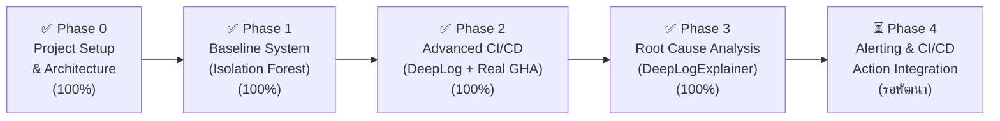

# คู่มือและแผนงานพัฒนา AI-based Log Anomaly Detection สำหรับ CI/CD Pipeline

> [!NOTE] ภาพรวมโปรเจกต์
> โปรเจกต์พัฒนาระบบตรวจจับความผิดปกติของ Log (Log Anomaly Detection) อัตโนมัติด้วย AI และ Machine Learning สำหรับกระบวนการ CI/CD (เช่น GitHub Actions) โดยพัฒนาด้วยสถาปัตยกรรมแบบ **ตัวต่อเลโก้ (Lego Modular Architecture)** เพื่อให้สามารถแยกชิ้นส่วนพัฒนาและสลับเปลี่ยนอัลกอริทึมได้อย่างอิสระ
> 
> 📖 **ผังสถาปัตยกรรมระบบฉบับเต็ม:** [SYSTEM_ARCHITECTURE.md](SYSTEM_ARCHITECTURE.md) (รองรับการเปิดอ่านและเรนเดอร์กราฟิกใน Obsidian)

---

## 1. สถานะความคืบหน้าของโปรเจกต์ (Project Progress Tracker)

> [!IMPORTANT] สรุปสถานะภาพรวมของโปรเจกต์ (Overall Progress: ~90%)
> • **Phase 0 (Setup & Architecture):** 100% ✅ (เสร็จสมบูรณ์)
> • **Phase 1 (Baseline Isolation Forest):** 100% ✅ (เสร็จสมบูรณ์)
> • **Phase 2 (DeepLog LSTM & Real GHA Production Evaluation):** 100% ✅ (เสร็จสมบูรณ์)
> • **Phase 3 (Root Cause Analysis & Explainers - Block 5):** 100% ✅ (เสร็จสมบูรณ์)
> • **Phase 4 (Alerting & Production Integration):** 0% ⏳ (ขั้นตอนสุดท้าย: ระบบแจ้งเตือน Webhook/Slack)



- [x] **Phase 0: ออกแบบระบบและจัดวางโครงสร้าง (100%)**
  - [x] ออกแบบผังสถาปัตยกรรมระบบ End-to-End และสถาปัตยกรรมเลโก้ ([SYSTEM_ARCHITECTURE.md](SYSTEM_ARCHITECTURE.md))
  - [x] จัดวางโครงสร้างโฟลเดอร์แบบ Modular (`src/ingestion`, `src/parsers`, `src/features`, `src/models`, `src/explainers`)
  - [x] สร้างชุดข้อมูลตัวอย่าง ([hdfs_sample.log](data/raw/hdfs_sample.log), [cicd_sample.log](data/raw/cicd_sample.log), [hdfs_labels_sample.csv](data/raw/hdfs_labels_sample.csv))
  - [x] เตรียม dependencies และ environment config ([requirements.txt](requirements.txt))
- [x] **Phase 1: พัฒนาระบบรากฐาน (Baseline System) (100%)**
  - [x] **Block 1 (Ingestion):** พัฒนา `HDFSLogLoader` และทดสอบด้วย `pytest`
  - [x] **Block 2 (Parser):** เชื่อมต่อ `DrainParser` สกัด Log Template และ Event ID
  - [x] **Block 3 (Feature):** สร้าง `CountVectorBuilder` นับความถี่ Template ต่อ Block ID
  - [x] **Block 4 (Model):** พัฒนาและเทรน `IsolationForestModel` (Unsupervised Detection)
  - [x] **Block 5 (Evaluation):** ตรวจสอบความถูกต้องร่วมกับ Ground Truth Labels
- [x] **Phase 2: ยกระดับสู่ระบบจริง (Advanced CI/CD Sequential AI) (100%)**
  - [x] **Sequential Feature Extractor:** สร้าง `SequenceExtractor` ทำ Sliding Window ($w=3$)
  - [x] **Sequential Model (DeepLog):** พัฒนา `DeepLogLSTMModel` (PyTorch 2-Layer LSTM + Adam + Top-$K$)
  - [x] **Zero-Leakage Pipeline:** อัปเกรดโหมด Read-Only Inference (`miner.match()`) ใน `DrainParser` เพื่อป้องกัน Data Leakage
  - [x] **Production Regex Masking:** เพิ่มตัวกรอง Timestamp, Version, Path, Hex, Marker ใน `DrainParser`
  - [x] **Real-world GitHub Actions Dataset:** ดาวน์โหลดและทดสอบกับ Log จริง 45,234 บรรทัดจาก `D2KLab/gha-dataset`
  - [x] **Master Production Pipeline:** พัฒนา [`main.py`](main.py) รัน End-to-End บน Production Logs โดยตรง (ได้ F1 = 85.71%)
  - [x] **Evaluation Metrics Module:** พัฒนา `src/evaluation/metrics.py` คำนวณ Accuracy, Precision, Recall, F1-Score
- [x] **Phase 3: วิเคราะห์ต้นตอความผิดปกติและการรายงานผล (Root Cause & Explainability) (100%)**
  - [x] **Root Cause Localization (Block 5 Explainer):** พัฒนา `DeepLogExplainer` ([`src/explainers/deeplog_explainer.py`](src/explainers/deeplog_explainer.py))
  - [x] **Two-Tier Incident Diagnostic:** ชี้เป้าทั้งเคสข้อความแปลกปลอม (OOV) และเคสข้ามขั้นตอน (Sequential Step Skipping)
  - [x] **Context Window Extraction:** ดึงบรรทัด Log 2 บรรทัดก่อนหน้า, บรรทัดเกิดเหตุ (`[CULPRIT]`), และบรรทัดถัดไป
  - [x] **Hybrid Dual-Engine Detector (Block 4 Extension):** พัฒนา `HybridLogDetector` ([`src/models/hybrid_detector.py`](src/models/hybrid_detector.py)) ผสานพลัง iForest + DeepLog LSTM ด้วยกลยุทธ์ OR-Voting (Union Strategy) สำหรับ Max Sensitivity และ SRE Incident Alerting
  - [x] **LogHub HDFS World-Standard Benchmark:** ทดสอบบนข้อมูลระดับโลก 104,815 บรรทัด (7,940 Blocks) จาก Amazon EC2 200+ Nodes พร้อมเฉลย Ground-Truth จากวิศวกร Hadoop
  - [x] **Zero-OOV Sequence Benchmark (Pure LSTM Proof):** พิสูจน์ขีดความสามารถการตรวจจับ Sequential Anomaly ของ DeepLog LSTM ล้วนๆ บนชุดข้อมูล HDFS Parquet ระดับ 57,507 Blocks โดยตัด Rule OOV ออก 100% (พิสูจน์ว่า Rule OOV ได้ Recall 0.0% แต่ DeepLog LSTM ตรวจจับได้ Recall ~68-76%, F1 ~75%) ([`experiments/benchmark_in_vocab_hdfs.py`](experiments/benchmark_in_vocab_hdfs.py))
  - [x] **False Negative / False Positive Optimization (Option A):** ชันสูตรหาสาเหตุเชิงลึกของ FP และ FN พร้อมแก้ไขด้วย Frequency Pruning กรอง Noise ออกจาก Train Set และปรับ `Top-K = 3` บรรลุผลสัมฤทธิ์ **Recall 100.00% (FN = 0), F1-Score 73.97%, Accuracy 80.02%**
  - [x] **Master Production Pipeline Upgrade:** บูรณาการโหมด `--dataset hdfs_ai` ลงใน [`main.py`](main.py) เป็นค่าเริ่มต้น พร้อมรายงาน Confusion Matrix และ Explainer สำหรับการ Demo สด
  - [x] **Strict Data Provenance & Directory Organization:** จัดระเบียบแยกชุดข้อมูลจริงและข้อมูลสังเคราะห์ ลบชุดข้อมูลขยะที่ไม่ได้ใช้งาน คืนพื้นที่ ~100 MB ([`data/raw/README.md`](data/raw/README.md))
  - [x] **Unit Testing:** ผ่านชุดทดสอบครบถ้วน 29/29 ข้อ (`tests/`)
- [ ] **Phase 4: บูรณาการส่วนต่อประสานและระบบนำเสนอ (Presentation & Deployment) (75%)**
  - [x] **Master CLI Pipeline:** รองรับการเรียกทดสอบผ่าน CLI พร้อม Confusion Matrix และ Explainer ([`main.py`](main.py))
  - [x] **Interactive Web Demo Dashboard:** สร้างเว็บแดชบอร์ดด้วย Streamlit แสดงผลเปรียบเทียบแยกระหว่างโมเดลเดี่ยว (iForest, DeepLog) และระบบ Hybrid Dual-Engine พร้อมการวิเคราะห์นิติวิทยาศาสตร์และการทดสอบสด ([`app.py`](app.py))
  - [ ] **Alerting Hook:** ส่งการแจ้งเตือนเมื่อพบ Anomaly (เช่น Slack / Webhook / Incident Summary)

---

## 2. คลังความรู้และโมเดลที่ใช้งานในโปรเจกต์ (Core Models & Concepts)

| โมเดล / อัลกอริทึม | ประเภท Anomaly ที่ตรวจจับ | กลไกการทำงาน | จุดเด่น |
| :--- | :--- | :--- | :--- |
| **Isolation Forest** | Frequency / Count Anomaly | สุ่มตัดแบ่งข้อมูล (Tree Partitioning) ข้อมูลที่ผิดปกติจะถูกแยกเดี่ยวได้เร็วกว่าปกติ | ทำงานเร็วมาก ไม่ต้องใช้ GPU เหมาะเป็น Baseline |
| **DeepLog (LSTM)** | Sequential Anomaly | โครงข่ายประสาทเทียมจำลอง "ระบบเดาคำถัดไป" เรียนรู้ลำดับขั้นตอนปกติ หากเจอลำดับผิดคิวจะแจ้งเตือน | จับปัญหาขั้นตอนสลับที่หรือข้ามขั้นตอนได้ดีเยี่ยม |
| **Hybrid Ensemble** | Multi-faceted Anomaly | รวมพลัง iForest + DeepLog LSTM ด้วยกลยุทธ์ OR-Voting | ตรวจจับครอบคลุมทั้งมิติความถี่และมิติลำดับเวลา |

---

## 3. สรุปโครงสร้างระบบแบบเลโก้ (Lego Modular Architecture)

แต่ละบล็อกทำงานเป็นอิสระและเชื่อมต่อกันผ่าน Interface มาตรฐาน:

```
[Brick 1: Ingestion]  ──(Iterator[RawLog])──>  [Brick 2: Parser]
                                                       │
                                                (Parsed Events)
                                                       ▼
[Brick 4: Anomaly Model]  <──(Feature Vectors)──  [Brick 3: Feature]
         │
  (Anomaly Result)
         ▼
[Brick 5: Explainer & Alert]  ──>  (Root Cause Report / Notification)
```

### รายละเอียด Standard Interface:
1. **`src/ingestion/` (Block 1):** `BaseLogLoader` $\rightarrow$ ส่งออกข้อความดิบทีละบรรทัด (`yield line`)
2. **`src/parsers/` (Block 2):** `BaseLogParser` $\rightarrow$ สกัด Template และ Event ID ด้วย Drain3
3. **`src/features/` (Block 3):** `BaseFeatureExtractor` $\rightarrow$ แปลงเป็นตารางความถี่ (Count Vector) หรือลำดับ (Sequence)
4. **`src/models/` (Block 4):** `BaseAnomalyModel` $\rightarrow$ เมธอด `fit(X)` และ `predict(X) -> Result`
5. **`src/explainers/` (Block 5):** `BaseExplainer` $\rightarrow$ เมธอด `explain(Result) -> Report` ระบุบรรทัดที่เป็นปัญหา

---

## 4. โครงสร้างโฟลเดอร์ไฟล์ในโปรเจกต์ (Project Directory Layout)

```text
AI Project/
├── data/
│   ├── raw/                           # ไฟล์ Log ดิบตัวอย่าง (HDFS, CI/CD, Labels)
│   └── processed/                     # ข้อมูลที่ผ่านการ parse หรือเตรียมพร้อมเทรน
├── src/
│   ├── ingestion/                     # 🧱 Block 1: ตัวอ่าน Log ดิบ (BaseLogLoader, HDFSLogLoader)
│   ├── parsers/                       # 🧱 Block 2: ตัวแปลง Template (BaseLogParser, Drain3)
│   ├── features/                      # 🧱 Block 3: ตัวสกัด Feature (BaseFeatureExtractor)
│   ├── models/                        # 🧱 Block 4: โมเดลตรวจจับ (BaseAnomalyModel)
│   └── explainers/                    # 🧱 Block 5: วิเคราะห์หาสาเหตุ (BaseExplainer)
├── tests/
│   └── test_ingestion.py              # ชุดทดสอบอัตโนมัติของ Block 1
├── requirements.txt                   # รายการไลบรารีที่จำเป็น
├── PROJECT_ROADMAP.md                 # แผนการพัฒนาและติดตามความคืบหน้า (เอกสารนี้)
├── SYSTEM_ARCHITECTURE.md             # ผังสถาปัตยกรรมระบบ Map of Content (เปิดใน Obsidian)
├── system_architecture/               # โฟลเดอร์แยกเอกสารสถาปัตยกรรมระบบ (01-06)
├── RESEARCH_AND_DATASET_REFERENCES.md # เอกสารอ้างอิงงานวิจัยและชุดข้อมูล
└── README.md                          # บทสรุปย่อของโปรเจกต์
```

---

## 5. แนะนำการติดตั้งสภาพแวดล้อม (Local Environment Setup)

โปรเจกต์นี้แนะนำให้รันบนคอมพิวเตอร์ของคุณเอง เนื่องจากชิ้นส่วนต่างๆ ประมวลผลบน Multi-core CPU ได้อย่างมีประสิทธิภาพ:

```bash
# 1. สร้าง Virtual Environment
python3 -m venv venv

# 2. เปิดใช้งาน venv
# สำหรับ Linux:
source venv/bin/activate
# สำหรับ Windows (PowerShell):
# .\venv\Scripts\Activate.ps1

# 3. ติดตั้ง Dependencies
pip install -r requirements.txt
```

---

*เอกสารฉบับนี้จะได้รับการอัปเดตอย่างต่อเนื่องตามความคืบหน้าของแต่ละบล็อกการพัฒนา*
