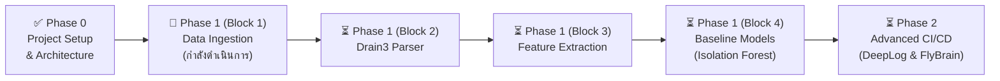

# คู่มือและแผนงานพัฒนา AI-based Log Anomaly Detection สำหรับ CI/CD Pipeline

> [!NOTE] ภาพรวมโปรเจกต์
> โปรเจกต์พัฒนาระบบตรวจจับความผิดปกติของ Log (Log Anomaly Detection) อัตโนมัติด้วย AI และ Machine Learning สำหรับกระบวนการ CI/CD (เช่น GitHub Actions) โดยพัฒนาด้วยสถาปัตยกรรมแบบ **ตัวต่อเลโก้ (Lego Modular Architecture)** เพื่อให้สามารถแยกชิ้นส่วนพัฒนาและสลับเปลี่ยนอัลกอริทึมได้อย่างอิสระ
> 
> 📖 **ผังสถาปัตยกรรมระบบฉบับเต็ม:** [SYSTEM_ARCHITECTURE.md](SYSTEM_ARCHITECTURE.md) (รองรับการเปิดอ่านและเรนเดอร์กราฟิกใน Obsidian)

---

## 1. สถานะความคืบหน้าของโปรเจกต์ (Project Progress Tracker)



- [x] **Phase 0: ออกแบบระบบและจัดวางโครงสร้าง**
  - [x] ออกแบบผังสถาปัตยกรรมระบบ End-to-End และสถาปัตยกรรมเลโก้ ([SYSTEM_ARCHITECTURE.md](SYSTEM_ARCHITECTURE.md))
  - [x] จัดวางโครงสร้างโฟลเดอร์แบบ Modular (`src/ingestion`, `src/parsers`, `src/features`, `src/models`, `src/explainers`)
  - [x] สร้างชุดข้อมูลตัวอย่าง ([hdfs_sample.log](data/raw/hdfs_sample.log), [cicd_sample.log](data/raw/cicd_sample.log), [hdfs_labels_sample.csv](data/raw/hdfs_labels_sample.csv))
  - [x] เตรียม dependencies และ environment config ([requirements.txt](requirements.txt))
- [ ] **Phase 1: พัฒนาระบบรากฐาน (Baseline System)**
  - [x] **Block 1 (Ingestion):** พัฒนา `HDFSLogLoader` และทดสอบด้วย `pytest` 👈 *(ขั้นตอนปัจจุบัน)*
  - [x] **Block 2 (Parser):** เชื่อมต่อ `Drain3Parser` สกัด Log Template และ Event ID
  - [ ] **Block 3 (Feature):** สร้าง `CountVectorBuilder` นับความถี่ Template ต่อ Block ID
  - [ ] **Block 4 (Model):** เทรน `Isolation Forest` (Unsupervised) และ `Logistic Regression` (Supervised Baseline)
  - [ ] **Block 5 (Evaluation):** วัดผลด้วย Precision, Recall, F1-Score
- [ ] **Phase 2: ยกระดับสู่ระบบจริง (Advanced CI/CD & Bio-inspired AI)**
  - [ ] **Mock CI/CD Generator:** จำลองเหตุการณ์ Timeout, IAM Denied, OOM, Workflow Skipping
  - [ ] **Sequential Model:** พัฒนา `DeepLog (LSTM)` สำหรับตรวจจับลำดับขั้นตอนผิดเพี้ยน
  - [ ] **Bio-inspired Novelty Detector:** พัฒนา `FlyBrainModel` (จำลองวงจรสมองแมลงวัน Fruit Fly Olfactory Circuit) เพื่อการตรวจจับที่รวดเร็วและใช้พลังงานต่ำ
  - [ ] **Root Cause Analysis:** วิเคราะห์ชี้เป้าบรรทัด Log ที่เป็นต้นเหตุของปัญหา

---

## 2. คลังความรู้และโมเดลที่ใช้งานในโปรเจกต์ (Core Models & Concepts)

| โมเดล / อัลกอริทึม | ประเภท Anomaly ที่ตรวจจับ | กลไกการทำงาน | จุดเด่น |
| :--- | :--- | :--- | :--- |
| **Isolation Forest** | Frequency / Count Anomaly | สุ่มตัดแบ่งข้อมูล (Tree Partitioning) ข้อมูลที่ผิดปกติจะถูกแยกเดี่ยวได้เร็วกว่าปกติ | ทำงานเร็วมาก ไม่ต้องใช้ GPU เหมาะเป็น Baseline |
| **DeepLog (LSTM)** | Sequential Anomaly | โครงข่ายประสาทเทียมจำลอง "ระบบเดาคำถัดไป" เรียนรู้ลำดับขั้นตอนปกติ หากเจอลำดับผิดคิวจะแจ้งเตือน | จับปัญหาขั้นตอนสลับที่หรือข้ามขั้นตอนได้ดีเยี่ยม |
| **FlyBrain Circuit** *(ทางเลือก)* | Novelty / Out-of-Distribution | จำลองวงจรเห็ดสมองแมลงวัน (Mushroom Body: Kenyon Cells + APL) ผ่าน Sparse Random Projection | เบามาก ระดับ $O(1)$ ไม่ต้องใช้ Backpropagation |

---

## 3. สรุปโครงสร้างระบบแบบเลโก้ (Lego Modular Architecture)

แต่ละบล็อกทำงานเป็นอิสระและเชื่อมต่อกันผ่าน Interface มาตรฐาน:

```
[Brick 1: Ingestion]  ──(Iterator[RawLog])──>  [Brick 2: Parser]
                                                       │
                                                (Parsed Events)
                                                       ▼
[Brick 4: Anomaly Model]  <──(Feature Vectors)──  [Brick 3: Feature]
         │
  (Anomaly Result)
         ▼
[Brick 5: Explainer & Alert]  ──>  (Root Cause Report / Notification)
```

### รายละเอียด Standard Interface:
1. **`src/ingestion/` (Block 1):** `BaseLogLoader` $\rightarrow$ ส่งออกข้อความดิบทีละบรรทัด (`yield line`)
2. **`src/parsers/` (Block 2):** `BaseLogParser` $\rightarrow$ สกัด Template และ Event ID ด้วย Drain3
3. **`src/features/` (Block 3):** `BaseFeatureExtractor` $\rightarrow$ แปลงเป็นตารางความถี่ (Count Vector) หรือลำดับ (Sequence)
4. **`src/models/` (Block 4):** `BaseAnomalyModel` $\rightarrow$ เมธอด `fit(X)` และ `predict(X) -> Result`
5. **`src/explainers/` (Block 5):** `BaseExplainer` $\rightarrow$ เมธอด `explain(Result) -> Report` ระบุบรรทัดที่เป็นปัญหา

---

## 4. โครงสร้างโฟลเดอร์ไฟล์ในโปรเจกต์ (Project Directory Layout)

```text
AI Project/
├── data/
│   ├── raw/                           # ไฟล์ Log ดิบตัวอย่าง (HDFS, CI/CD, Labels)
│   └── processed/                     # ข้อมูลที่ผ่านการ parse หรือเตรียมพร้อมเทรน
├── src/
│   ├── ingestion/                     # 🧱 Block 1: ตัวอ่าน Log ดิบ (BaseLogLoader, HDFSLogLoader)
│   ├── parsers/                       # 🧱 Block 2: ตัวแปลง Template (BaseLogParser, Drain3)
│   ├── features/                      # 🧱 Block 3: ตัวสกัด Feature (BaseFeatureExtractor)
│   ├── models/                        # 🧱 Block 4: โมเดลตรวจจับ (BaseAnomalyModel)
│   └── explainers/                    # 🧱 Block 5: วิเคราะห์หาสาเหตุ (BaseExplainer)
├── tests/
│   └── test_ingestion.py              # ชุดทดสอบอัตโนมัติของ Block 1
├── requirements.txt                   # รายการไลบรารีที่จำเป็น
├── PROJECT_ROADMAP.md                 # แผนการพัฒนาและติดตามความคืบหน้า (เอกสารนี้)
├── SYSTEM_ARCHITECTURE.md             # ผังสถาปัตยกรรมระบบฉบับละเอียด (เปิดใน Obsidian)
└── README.md                          # บทสรุปย่อของโปรเจกต์
```

---

## 5. แนะนำการติดตั้งสภาพแวดล้อม (Local Environment Setup)

โปรเจกต์นี้แนะนำให้รันบนคอมพิวเตอร์ของคุณเอง เนื่องจากชิ้นส่วนต่างๆ ประมวลผลบน Multi-core CPU ได้อย่างมีประสิทธิภาพ:

```bash
# 1. สร้าง Virtual Environment
python3 -m venv venv

# 2. เปิดใช้งาน venv
# สำหรับ Linux:
source venv/bin/activate
# สำหรับ Windows (PowerShell):
# .\venv\Scripts\Activate.ps1

# 3. ติดตั้ง Dependencies
pip install -r requirements.txt
```

---

*เอกสารฉบับนี้จะได้รับการอัปเดตอย่างต่อเนื่องตามความคืบหน้าของแต่ละบล็อกการพัฒนา*
