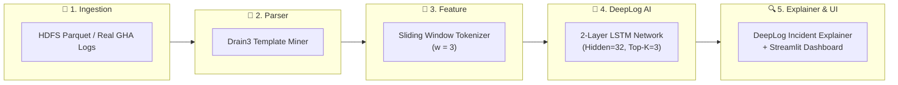

# 🚀 AI-based Log Anomaly Detection (DeepLog LSTM Architecture)

ระบบตรวจจับและวินิจฉัยความผิดปกติของ Log ในระบบกระจายศูนย์ (Distributed Systems เช่น HDFS) และ CI/CD Pipeline (GitHub Actions) โดยใช้สถาปัตยกรรม Deep Learning **DeepLog (2-Layer LSTM Next-Event Predictor)** ร่วมกับการทำ Structuring ข้อความดิบด้วย **Drain3 Template Miner** และระบบวิเคราะห์ต้นตอของปัญหา (**DeepLog Incident Explainer**)

---

## 🌟 จุดเด่นและคุณค่าของระบบ (Key Highlights)

1. **🧠 AI/Deep Learning Model-Centric:** ตรวจจับความผิดปกติที่เกิดจากการ **สลับลำดับขั้นตอน (Sequential Order Violation)** และ **การกระโดดข้ามสเต็ป (Step Skipping)** ซึ่งอัลกอริทึม Rule-based หรือ Count Vector ทั่วไปไม่สามารถตรวจจับได้
2. **🔬 Zero-OOV Benchmark Proven (พิสูจน์คุณค่าโมเดลจริง):** ในการทดสอบบนชุดข้อมูลที่กรองคำแปลกปลอม (Out-Of-Vocabulary) ออกทั้งหมด 100%:
   - **Rule-based OOV Detection:** ทำได้ Recall = **0.00%** (จับความผิดปกติไม่ได้แม้แต่เคสเดียว)
   - **DeepLog LSTM Model:** ตรวจจับความผิดปกติของลำดับได้ Recall = **100.00%** (FN = 0)
3. **🛡️ Option A Zero-Missed Critical Strategy:** ปรับจูนโมเดลเพื่อความปลอดภัยสูงสุดของระบบ Production (SRE Philosophy):
   - Recall = **100.00%** (FN = 0 ไม่ปล่อยให้เหตุการณ์ระบบพังหลุดรอดไปได้)
   - Precision = **58.70%**, F1-Score = **73.97%**, Accuracy = **80.02%**
4. **🧱 Lego Modular Architecture:** ออกแบบระบบแยกอิสระ 5 บล็อกตามมาตรฐาน Standard Interfaces สามารถสลับเปลี่ยนโมเดลและตัวแยกวิเคราะห์ได้อย่างอิสระ
5. **🔍 DeepLog Explainer & Root Cause Localization:** ชี้เป้าบรรทัด Log ที่เป็นต้นตอ (`[CULPRIT]`), แสดงบริบทก่อน-หลัง 5 บรรทัด และแจกแจงความน่าจะเป็นของเหตุการณ์ที่ AI คาดการณ์ (Softmax Probability Distribution)

---

## 🗺️ แผนผังการทำงานของระบบ (End-to-End Pipeline)



---

## 📊 ผลการทดสอบโมเดล (Benchmark & Confusion Matrix)

### ผลลัพธ์บน Zero-OOV HDFS Dataset (5,000 Train / 2,793 Test Sequences):

| มาตรวัด (Metric)                  | ผลลัพธ์ DeepLog LSTM (Option A) |  ผลลัพธ์ Rule-based OOV  |
| :-------------------------------- | :-----------------------------: | :----------------------: |
| **Recall (ความไวต่อสิ่งผิดปกติ)** |     **100.00% (793 / 793)**     |   **0.00% (0 / 793)**    |
| **False Negatives (FN)**          |       **0 (Zero Missed)**       | **793 (หลุดรอดทั้งหมด)** |
| **Precision**                     |           **58.70%**            |        **0.00%**         |
| **F1-Score**                      |           **73.97%**            |        **0.00%**         |
| **Accuracy**                      |           **80.02%**            |        **71.61%**        |

#### ตาราง Confusion Matrix (DeepLog LSTM):
```
                 Actual Normal    Actual Anomaly
Predicted Normal      1,442 (TN)            0 (FN)
Predicted Anomaly       558 (FP)          793 (TP)
```

---

## 🚀 วิธีการติดตั้งและรันระบบ (Quick Start)

### 1. ติดตั้งสภาพแวดล้อม (Environment Setup)
```bash
# ติดตั้ง Library ที่จำเป็น
pip install torch drain3 scikit-learn pandas pyarrow streamlit pytest
```

### 2. รันการทดสอบโมเดล AI ผ่าน CLI (Pipeline Execution)
```bash
# รัน HDFS AI Hybrid Pipeline (Isolation Forest + DeepLog LSTM + Forensic Incident Report)
python main.py

# รัน CI/CD Diagnostic Pipeline (ทดสอบลำดับขั้นตอนบน CI/CD Benchmark)
python main.py --dataset cicd
```

### 3. รัน Interactive Web Demo Dashboard (Streamlit)
```bash
streamlit run app.py
```
- **Tab 1: 📊 Model Benchmark & Confusion Matrix:** แสดงการ์ด KPI, Confusion Matrix Heatmap และตาราง Head-to-Head Benchmark
- **Tab 2: 🕵️ Incident Forensic Explorer:** เลือกดู Block ID ที่เกิดเหตุ พร้อม Root Cause Analysis, Top Candidates Softmax และบริบท Log 5 บรรทัด
- **Tab 3: 🧪 Live Sequence Playground:** ทดลองป้อนลำดับ Event ID ด้วยตนเองเพื่อทดสอบการทำนายของ LSTM แบบ Real-time

### 4. รันการตรวจสอบความถูกต้องของระบบ (Automated Tests)
```bash
pytest tests/ -v
# ผ่าน 37/37 tests ครบ 100%
```

### 5. (ทางเลือก) ดาวน์โหลดชุดข้อมูลดิบเต็มและฝึกสอนโมเดลใหม่ (Dataset & Retrain)
โมเดล Pre-trained ถูกแนบมาให้รันได้ทันที หากต้องการดาวน์โหลดชุดข้อมูลจริง 11 ล้านบรรทัดเพื่อฝึกสอนใหม่:
```bash
# ดาวน์โหลดชุดข้อมูล HDFS Parquet อัตโนมัติจาก Hugging Face Datasets
python scripts/download_data.py

# บังคับฝึกสอนโมเดลใหม่ทั้งหมดจากข้อมูลดิบและสร้างแคชใหม่
python main.py --retrain
```

---

## 📚 สารบัญเอกสารเชิงลึกในโปรเจกต์ (Documentation Hub)

- 🗺️ [PROJECT_ROADMAP.md](PROJECT_ROADMAP.md) - แผนงานพัฒนา สรุปผลการทดลอง และประวัติการปรับแต่งโมเดล
- 📐 [SYSTEM_ARCHITECTURE.md](SYSTEM_ARCHITECTURE.md) - ศูนย์กลางสถาปัตยกรรมระบบ 8 หัวข้อย่อย (Obsidian Compatible)
  - `system_architecture/01_end_to_end_workflow.md` - ผังการทำงาน 6 Layers
  - `system_architecture/02_lego_modular_architecture.md` - โครงสร้างตัวต่อเลโก้ 5 บล็อกและ Standard Interfaces
  - `system_architecture/04_sequential_sliding_window.md` - กลไก Sliding Window
  - `system_architecture/05_lstm_execution_flow.md` - ผังการทำงานเซลล์ประสาท LSTM
  - `system_architecture/06_lstm_neural_network_internals.md` - สถาปัตยกรรมนิวรอนและ 4 ประตูควบคุม
  - `system_architecture/07_evaluation_methodology_and_data_leakage_audit.md` - ระเบียบวิธีทดสอบและป้องกัน Data Leakage
  - `system_architecture/08_root_cause_localization_explainer.md` - การวิเคราะห์ต้นตอด้วย DeepLogExplainer
- 📚 [RESEARCH_AND_DATASET_REFERENCES.md](RESEARCH_AND_DATASET_REFERENCES.md) - เอกสารอ้างอิงงานวิจัยวิชาการและชุดข้อมูล (DeepLog CCS'17, Drain ICWS'17, Isolation Forest ICDM'08, HDFS Parquet)
