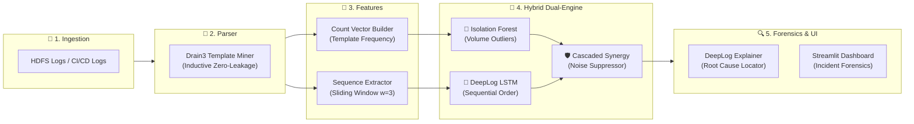

# 🐕 LogWatchdog: Hybrid Dual-Engine AI Log Anomaly Detection

ระบบตรวจจับและวินิจฉัยความผิดปกติของ Log ในระบบกระจายศูนย์ (Distributed Systems เช่น HDFS) และ CI/CD Pipeline (GitHub Actions) โดยใช้สถาปัตยกรรม **Hybrid Dual-Engine** ที่ผสานพลังของ **Isolation Forest (ด่านตรวจความถี่ / Volume & Count Outliers)** ร่วมกับ **DeepLog 2-Layer LSTM (ด่านตรวจลำดับเวลาและขั้นตอน / Sequential Transitions)** ผ่านกลไก **Cascaded Synergy** พร้อมระบบสกัดโครงสร้างข้อความ **Drain3 Template Miner** และระบบชันสูตรชี้เป้าต้นตอของปัญหา (**Incident Diagnostic Explainer**)

---

## 🌟 จุดเด่นและคุณค่าของระบบ (Key Highlights)

1. **🛡️ สถาปัตยกรรมผสานพลัง (Cascaded Synergy Dual-Engine):**
   - **DeepLog LSTM:** รับหน้าที่เป็น "เรดาร์กวาดจับความปลอดภัย" ตรวจจับลำดับขั้นตอนผิดปกติ รักษา **Recall = 100.00% (FN = 0)**
   - **Isolation Forest:** รับหน้าที่เป็น "ด่านกรองเสียงรบกวน (Density Validator)" คัดกรองการแจ้งเตือนที่เกิดจากความผันผวนปกติ ช่วยลด False Positive ลงได้ถึง **46.9%** (ลดจาก 539 เหลือ 286 บล็อก)
   - ส่งผลให้ค่า **F1-Score พุ่งแตะ 84.72%** (เพิ่มขึ้นอย่างมีนัยสำคัญ +10.08% เหนือกว่าโมเดลเดี่ยว)
2. **🧠 Pure Sequential Intelligence (แก้โจทย์ที่ Rule-based ทำไม่ได้):**
   - ตรวจจับความผิดปกติที่เกิดจากการ **สลับลำดับขั้นตอน (Sequential Order Violation)** และ **การข้ามสเต็ป (Step Skipping)**
   - ในการทดสอบแบบ Zero-OOV Benchmark (ตัดคำแปลกปลอมออก 100%): ระบบ **Rule-based OOV ทำได้ Recall = 0.00%** (หลุดรอดหมด) ขณะที่ระบบ AI ของเราทำได้ **Recall = 100.00%**
3. **🔍 Root Cause Localization (Block 5 Explainer):**
   - ชี้เป้าพิกัดบรรทัด Log ที่เป็นต้นเหตุทันที (`[CULPRIT]`) พร้อมดึง Context Window 5 บรรทัดแวดล้อม
   - แจกแจงการตัดสินใจด้วย Softmax Probability Distribution (เปรียบเทียบสิ่งที่ AI คาดหวัง vs สิ่งที่เกิดขึ้นจริง)
4. **🧱 Lego Modular Architecture:** ออกแบบระบบแยกอิสระ 5 บล็อกตามมาตรฐาน Standard Interfaces สามารถสลับเปลี่ยนโมเดลและตัวแยกวิเคราะห์ได้อย่างอิสระ
5. **⚡ Zero-Friction Out-of-the-Box Execution:** แนบ Pretrained Checkpoints ขนาดกะทัดรัด (< 500 KB) ทำให้ผู้ที่ Clone โครงงานไปสามารถรัน Web Dashboard และ Pipeline ได้ทันทีใน 1 วินาที

---

## 🗺️ แผนผังการทำงานของระบบ (End-to-End Pipeline)



---

## 📊 ผลการทดสอบเปรียบเทียบโมเดล (Comparative Benchmark Evaluation)

การประเมินผลบนชุดทดสอบมาตรฐาน **HDFS Zero-OOV Test Benchmark จำนวน 2,793 Sessions** (Normal 2,000 + Anomaly 793 Sessions):

| มาตรวัดประสิทธิภาพ (Metric) | 🌲 Isolation Forest (Baseline) | 🧠 DeepLog LSTM (Option A) | 🛡️ LogWatchdog Hybrid (Cascaded Synergy) | การเปลี่ยนแปลง (vs LSTM) |
| :--- | :---: | :---: | :---: | :---: |
| **Recall (ความไวต่อสิ่งผิดปกติ)** | 28.25% (224 / 793) | **100.00% (793 / 793)** | **100.00% (793 / 793)** | **คงที่ 100% (Zero Miss)** |
| **False Negatives (FN หลุดรอด)** | 569 Sessions | **0 Sessions** | **0 Sessions** | **0 (ไม่ปล่อยเคสหลุด)** |
| **False Positives (FP เตือนลวง)** | 178 Sessions | 539 Sessions | **286 Sessions** | **ลดลง 46.9% (-253 บล็อก)** |
| **Precision (ความแม่นยำเตือน)** | 55.72% | 59.53% | **73.49%** | **+13.96%** |
| **F1-Score (คะแนนเฉลี่ยฮาร์โมนิก)** | 37.49% | 74.64% | **84.72%** | **+10.08%** (สูงสุด) |
| **Accuracy (ความถูกต้องโดยรวม)** | 73.25% | 80.70% | **89.76%** | **+9.06%** |

#### ตาราง Confusion Matrix (LogWatchdog Hybrid Dual-Engine):
```
                       Actual Normal (0)      Actual Anomaly (1)
Predicted Normal (0)       1,714 (TN)                 0 (FN)       -> Zero Missed!
Predicted Anomaly (1)        286 (FP)               793 (TP)       -> ลด FP ลง 46.9%
```

---

## 🚀 วิธีการติดตั้งและรันระบบ (Quick Start)

### 1. ติดตั้งสภาพแวดล้อม (Environment Setup)
```bash
# ติดตั้ง Library ที่จำเป็น
pip install torch drain3 scikit-learn pandas pyarrow streamlit pytest
```

### 2. รันการทดสอบโมเดล AI ผ่าน CLI (Pipeline Execution)
```bash
# รัน HDFS AI Hybrid Pipeline (Isolation Forest + DeepLog LSTM + Forensic Incident Report)
python main.py

# รัน CI/CD Diagnostic Pipeline (ทดสอบลำดับขั้นตอนบน CI/CD Benchmark)
python main.py --dataset cicd
```

### 3. รัน Interactive Web Demo Dashboard (Streamlit)
```bash
streamlit run app.py
```
- **Tab 1: 📊 Model Benchmark & Confusion Matrix:** แสดงการ์ด KPI, Confusion Matrix Heatmap และตาราง Head-to-Head Benchmark
- **Tab 2: 🕵️ Incident Forensic Explorer:** เลือกดู Block ID ที่เกิดเหตุ พร้อม Root Cause Analysis, Top Candidates Softmax และบริบท Log 5 บรรทัด
- **Tab 3: 🧪 Live Sequence Playground:** ทดลองป้อนลำดับ Event ID ด้วยตนเองเพื่อทดสอบการทำนายของ LSTM แบบ Real-time

### 4. รันการตรวจสอบความถูกต้องของระบบ (Automated Tests)
```bash
pytest tests/ -v
# ผ่าน 37/37 tests ครบ 100%
```

### 5. (ทางเลือก) ดาวน์โหลดชุดข้อมูลดิบเต็มและฝึกสอนโมเดลใหม่ (Dataset & Retrain)
โมเดล Pre-trained ถูกแนบมาให้รันได้ทันที หากต้องการดาวน์โหลดชุดข้อมูลจริง 11 ล้านบรรทัดเพื่อฝึกสอนใหม่:
```bash
# ดาวน์โหลดชุดข้อมูล HDFS Parquet อัตโนมัติจาก Hugging Face Datasets
python scripts/download_data.py

# บังคับฝึกสอนโมเดลใหม่ทั้งหมดจากข้อมูลดิบและสร้างแคชใหม่
python main.py --retrain
```

---

## 📚 สารบัญเอกสารเชิงลึกในโปรเจกต์ (Documentation Hub)

- 🗺️ [PROJECT_ROADMAP.md](PROJECT_ROADMAP.md) - แผนงานพัฒนา สรุปผลการทดลอง และประวัติการปรับแต่งโมเดล
- 📐 [SYSTEM_ARCHITECTURE.md](SYSTEM_ARCHITECTURE.md) - ศูนย์กลางสถาปัตยกรรมระบบ 8 หัวข้อย่อย (Obsidian Compatible)
  - `system_architecture/01_end_to_end_workflow.md` - ผังการทำงาน 6 Layers
  - `system_architecture/02_lego_modular_architecture.md` - โครงสร้างตัวต่อเลโก้ 5 บล็อกและ Standard Interfaces
  - `system_architecture/04_sequential_sliding_window.md` - กลไก Sliding Window
  - `system_architecture/05_lstm_execution_flow.md` - ผังการทำงานเซลล์ประสาท LSTM
  - `system_architecture/06_lstm_neural_network_internals.md` - สถาปัตยกรรมนิวรอนและ 4 ประตูควบคุม
  - `system_architecture/07_evaluation_methodology_and_data_leakage_audit.md` - ระเบียบวิธีทดสอบและป้องกัน Data Leakage
  - `system_architecture/08_root_cause_localization_explainer.md` - การวิเคราะห์ต้นตอด้วย DeepLogExplainer
- 📚 [RESEARCH_AND_DATASET_REFERENCES.md](RESEARCH_AND_DATASET_REFERENCES.md) - เอกสารอ้างอิงงานวิจัยวิชาการและชุดข้อมูล (DeepLog CCS'17, Drain ICWS'17, Isolation Forest ICDM'08, HDFS Parquet)
