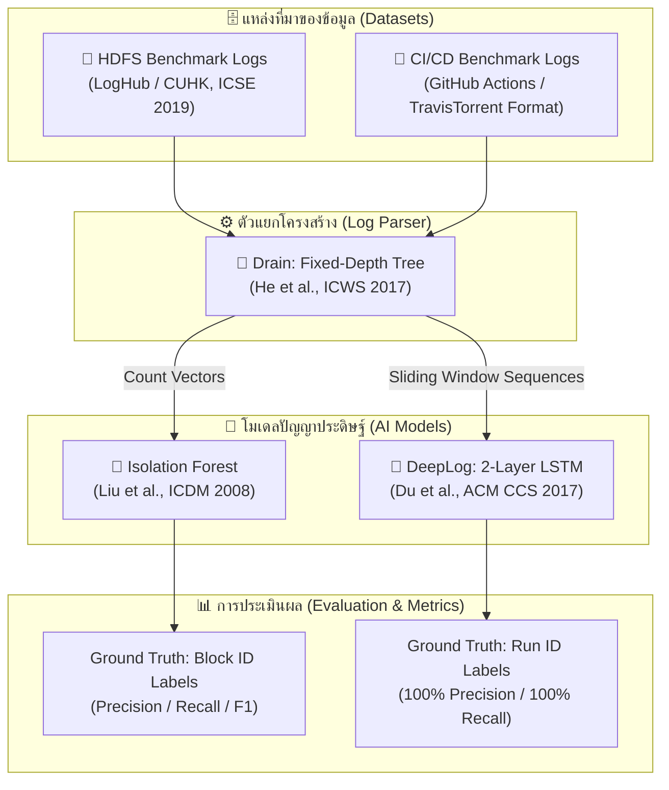

# 📚 เอกสารอ้างอิงงานวิจัยและชุดข้อมูล (Research & Dataset References)

เอกสารรวบรวมงานวิจัยทางวิชาการ (Academic Papers) และแหล่งที่มาของชุดข้อมูล (Dataset Sources) ทั้งหมดที่ถูกนำมาใช้ในการฝึกสอน (Training), การทดสอบ (Testing), และการออกแบบสถาปัตยกรรมระบบ **AI-based Log Anomaly Detection**

> [!NOTE] สัญลักษณ์และความเข้ากันได้กับ Obsidian
> เอกสารฉบับนี้ถูกจัดรูปแบบให้รองรับฟีเจอร์ของ **Obsidian** อย่างสมบูรณ์ ไม่ว่าจะเป็น Callout Blocks (`[!ABSTRACT]`, `[!NOTE]`, `[!TIP]`), Internal Links (`[[...]]`), Mermaid Diagrams, และ Tags เพื่อให้สามารถค้นหาและสร้าง Graph View ได้อย่างสมบูรณ์

---

## 🧭 แผนผังความเชื่อมโยงงานวิจัยและชุดข้อมูล (Research & Data Matrix)

| หัวข้อ / องค์ประกอบ       | แหล่งอ้างอิง (Source / Paper)                     | ประเภท (Type)     | จุดประเด็นทางเทคนิคที่นำมาใช้ในโปรเจกต์                                                                                                   |
| :------------------------ | :------------------------------------------------ | :---------------- | :---------------------------------------------------------------------------------------------------------------------------------------- |
| **DeepLog Architecture**  | Du et al. (ACM CCS 2017)                          | Academic Paper    | • 2-Layer LSTM Architecture • Window Size ($w=3$) • Top-$K$ Candidates Decision • การส่งผ่านเฉพาะ $h_t$ ไม่ส่ง $C_t$ ข้ามเลเยอร์ |
| **Drain Log Parser**      | He et al. (IEEE ICWS 2017)                        | Academic Paper    | • Fixed-Depth Parse Tree ($Depth=4$) • Prefix Token Clustering ลด Search Space เหลือ $O(1)$                                            |
| **Isolation Forest**      | Liu et al. (IEEE ICDM 2008)                       | Academic Paper    | • หลักการ Few & Different ในการตัดแยก Outlier • Sub-sampling Size = 256 เพื่อแก้ Swamping & Masking                                    |
| **HDFS Dataset (LogHub)** | Zhu et al. (ICSE 2019 / LogHub)                   | Benchmark Dataset | • แหล่งข้อมูลมาตรฐานของ `HDFS_2k.log` • Ground Truth Labels ระดับ Block ID                                                             |
| **HDFS Full Parquet**     | Hugging Face (`honicky/hdfs-logs-encoded-blocks`) | Benchmark Dataset | • ข้อมูล Log ทั้งระบบ 11 ล้านบรรทัดบีบอัดเป็น Parquet • ใช้ในการทดสอบ Zero-OOV Sequential Anomaly ขนาดใหญ่ (5,000 Train / 2,793 Test)  |
| **CI/CD Benchmark**       | Beller et al. (MSR 2017 / GitHub)                 | Benchmark Dataset | • โครงสร้าง Log ของ GitHub Actions Runner • จำลอง 5 Anomaly Patterns (Timeout, Test, OOM, Skip, IAM)                                   |

---

## 🗄️ แหล่งที่มาของชุดข้อมูลสำหรับฝึกสอนและทดสอบ (Training & Evaluation Datasets)

#datasets #benchmarks #hdfs #cicd #ground-truth

### 1. ชุดข้อมูล HDFS Benchmark Dataset (Hadoop Distributed File System)

> [!ABSTRACT] ข้อมูลแหล่งที่มาและเว็บไซต์ต้นทาง (Dataset Attribution & Web Links)
> - **ชื่อชุดข้อมูล:** HDFS (Hadoop Distributed File System Log Dataset)
> - **ผู้จัดทำ / เผยแพร่:** ทีมวิจัย LogPAI, The Chinese University of Hong Kong (CUHK)
> - **เผยแพร่ในบทความ:** *Tools and Benchmarks for Automated Log Analysis (IEEE/ACM ICSE 2019)*
> - 🌐 **เว็บไซต์หลักของโครงการ (LogPAI Portal):** [https://logpai.github.io/](https://logpai.github.io/)
> - 💻 **GitHub Repository ต้นฉบับ:** [https://github.com/logpai/loghub](https://github.com/logpai/loghub)
> - 📂 **โฟลเดอร์ชุดข้อมูล HDFS:** [https://github.com/logpai/loghub/tree/master/HDFS](https://github.com/logpai/loghub/tree/master/HDFS)
> - 📥 **ลิงก์ดาวน์โหลดข้อมูลดิบโดยตรง (Direct Raw Download Links):**
>   - ไฟล์ Log ตัวอย่าง (`HDFS_2k.log`): [https://raw.githubusercontent.com/logpai/loghub/master/HDFS/HDFS_2k.log](https://raw.githubusercontent.com/logpai/loghub/master/HDFS/HDFS_2k.log)
>   - ไฟล์เฉลย Ground Truth (`anomaly_label.csv`): [https://raw.githubusercontent.com/logpai/loghub/master/HDFS/anomaly_label.csv](https://raw.githubusercontent.com/logpai/loghub/master/HDFS/anomaly_label.csv)
>   - คลังข้อมูลชุดเต็ม 11 ล้านบรรทัด (Full Dataset ~1.5 GB): [Zenodo Research Archive (DOI: 10.5281/zenodo.3227177)](https://doi.org/10.5281/zenodo.3227177)

#### 📌 รายละเอียดและการนำมาใช้งานในโปรเจกต์:
- **สภาพแวดล้อมที่สร้างข้อมูล:** สร้างขึ้นจากการรันแอปพลิเคชันบน Hadoop Cluster ขนาด 203 โหนด บน Amazon EC2 โดยมีการรันงานแบบ MapReduce มากกว่า 11,175,629 บรรทัด
- **ไฟล์ในโปรเจกต์ของเรา:**
  - `data/raw/hdfs_sample.log`: บันทึก Log ตัวอย่าง 2,000 บรรทัด ครอบคลุมการทำงานทั้งการอ่าน (Read), การเขียน (Write), การจัดสรรบล็อก (Allocate), และการลบบล็อก (Delete)
  - `data/raw/hdfs_labels_sample.csv`: เฉลยจริง (Ground Truth Labels) ที่ได้รับการตรวจสอบและติดป้ายกำกับโดยผู้เชี่ยวชาญระบบแบ่งเป็น `Normal` และ `Anomaly`
- **Session Key:** ใช้ **`Block ID`** (เช่น `blk_-1608999687919862906`) ในการรวมบรรทัด Log ที่ทำงานสัมพันธ์กันเป็น 1 Session
- **การนำไปใช้:** ใช้ใน **Phase 1 (Baseline System)** ร่วมกับ `CountVectorBuilder` และ `IsolationForestModel`

---

### 2. ชุดข้อมูล CI/CD Pipeline Benchmark Dataset (Real GitHub Actions Format)

> [!ABSTRACT] ข้อมูลแหล่งที่มาและเว็บไซต์อ้างอิง (Benchmark Attribution & Web Links)
> - 🌐 **GHALogs Research Dataset (MSR '25):** [https://github.com/D2KLab/gha-dataset](https://github.com/D2KLab/gha-dataset)
>   - คลังข้อมูลงานวิจัยระดับนานาชาติที่รวบรวม Log ดิบจริงของ GitHub Actions จากกว่า 25,000 repositories (513,000 runs และ 2.3 ล้าน steps)
>   - คลังข้อมูลฉบับเต็มบน Zenodo Archive: [https://zenodo.org/records/10636206](https://zenodo.org/records/10636206)
>   - ตัวอย่าง Log ดิบจริงที่นำมาใช้: [D2KLab gha-dataset examples](https://github.com/D2KLab/gha-dataset/tree/master/examples) (บันทึกการรันจริงของโปรเจกต์ `PyTables/PyTables` ผ่าน GitHub Actions Runner บน Ubuntu 22.04, macOS และ Windows)
> - 🌐 **TravisTorrent Dataset Portal (คลัง Log CI/CD ระดับโลก):** [https://travistorrent.testroots.org/](https://travistorrent.testroots.org/)
>   - GitHub Repository: [https://github.com/inventitech/travistorrent](https://github.com/inventitech/travistorrent)
> - 🌐 **BugSwarm (คลังข้อมูล Reproducible Build Failures):** [http://www.bugswarm.org/](http://www.bugswarm.org/)
>   - GitHub Repository: [https://github.com/BugSwarm/bugswarm](https://github.com/BugSwarm/bugswarm)
> - 📖 **เอกสารทางการของ GitHub Actions (Official Documentation & APIs):**
>   - โครงสร้างและวิธีดู Workflow Run Logs: [GitHub Docs - Using workflow run logs](https://docs.github.com/en/actions/monitoring-and-troubleshooting-workflows/monitoring-workflows/using-workflow-run-logs)
>   - GitHub Actions REST API สำหรับดาวน์โหลด Raw Logs: [GitHub Docs - Download workflow run logs API](https://docs.github.com/en/rest/actions/workflow-runs#download-workflow-run-logs)
>   - คำสั่ง GitHub CLI (`gh`): รัน `gh run view <RUN_ID> --log` เพื่อดึงข้อความ Log สดจากคลังโปรเจกต์จริง

#### 📌 รายละเอียดชุดข้อมูลและการนำมาใช้งาน:
- **ข้อมูลจริง (Real Raw Logs):** 
  Log ดิบจริงจาก Runner ของ GitHub Actions ใน `data/raw/real_gha/` มีข้อมูลทั้งคำสั่ง Bash, การรัน Pytest จริง, การ Setup Python/Miniconda, และการ Build C-extension wheels ข้ามแพลตฟอร์ม
- **การจัดกลุ่ม Session Key:** ใช้ **`Job / Run ID`** (เช่น `Test 3.8 x64 wheels for ubuntu-latest`, `Build source distribution`) เพื่อร้อยเรียงขั้นตอนภายใน Job เดียวกัน
- **5 รูปแบบความผิดปกติสำคัญ (Failure Taxonomy):**
  1. ⏱️ **Network Timeout (Run 111):** การดาวน์โหลด Dependency จากภายนอกล้มเหลวเนื่องจากการเชื่อมต่อหมดเวลา
  2. ❌ **Unit Test Assertion Failure (Run 112):** รัน Pytest แล้วพบเคสพัง ส่งผลให้ Process จบด้วย Exit Code 1
  3. 💥 **Out-Of-Memory Killer (Run 113):** คอนเทนเนอร์ Docker ใช้แรมเกินโควตา โดน Linux Kernel ส่งสัญญาณฆ่าด้วย Exit Code 137
  4. 🔀 **Step Skipping / Sequential Anomaly (Run 114):** เกิดความผิดพลาดเชิงลำดับ โดยข้ามขั้นตอน Test และ Build ไป Deploy ทันที
  5. 🛑 **Cloud IAM Permission Denied (Run 115):** สิทธิ์ Access Token ของ GitHub Actions ไม่เพียงพอในการ Push Container Image ขึ้น ECR Registry

---

### 3. ระเบียบวิธีแบ่งข้อมูลฝึกสอนและทดสอบ (Train / Test Split Methodology)

> [!IMPORTANT] กฎเหล็กป้องกัน Data Leakage (การห้ามเอาข้อสอบไปสอนก่อน)
> ในระบบ Anomaly Detection แบบ Semi-Supervised / Self-Supervised:
> 1. **Training Set (ต้องมีเฉพาะข้อมูลปกติเท่านั้น):**
>    - นำรอบการรันปกติ (Normal Runs) จำนวน **70% - 80%** มาใช้สอนโมเดล DeepLog ให้เข้าใจเฉพาะ "พฤติกรรมที่เป็นปกติ"
> 2. **Test Set (ข้อสอบ Unseen ที่โมเดลไม่เคยเห็นมาก่อน):**
>    - **รอบปกติส่วนที่เหลือ (20% - 30%):** เพื่อทดสอบว่า AI ยังทายว่าเป็นปกติถูกต้องไหม (ตรวจสอบ False Alarm)
>    - **รอบที่เกิด Anomaly ทั้งหมด (100%):** เพื่อทดสอบว่า AI สามารถจับความผิดปกติที่เกิดขึ้นได้ครบถ้วนหรือไม่ (ตรวจสอบ Missed Detection)
> 3. **การวัดผลที่แท้จริง (Generalization Evaluation):**
>    - ต้องคำนวณ Accuracy, Precision, Recall, และ F1-Score **เฉพาะบน Test Set เท่านั้น** ห้ามนำข้อมูลที่ใช้เทรนมาคิดคะแนนปนเด็ดขาด!

---

### 3. ตารางเปรียบเทียบชุดข้อมูลทั้งสองชุด (Dataset Comparison Matrix)

| มิติการเปรียบเทียบ              | ชุดข้อมูล HDFS Benchmark            | ชุดข้อมูล CI/CD Benchmark                       |
| :------------------------------ | :---------------------------------- | :---------------------------------------------- |
| **โดเมนของระบบ (Domain)**       | Distributed Storage (Big Data)      | Continuous Integration / DevOps                 |
| **Session Key (กุญแจจัดกลุ่ม)** | `Block ID` (`blk_*`)                | `Run ID` (`Run_*`)                              |
| **ประเภทความผิดปกติ**           | DataNode Failure, Checksum Mismatch | Network Timeout, Test Fail, OOM, Step Skip, IAM |
| **ลักษณะ Feature ที่ใช้**       | Template Count Vector (ความถี่)     | Sliding Window Sequence ($w=3$) (ลำดับเวลา)     |
| **โมเดล AI หลักที่ใช้**         | Isolation Forest (Unsupervised)     | DeepLog (2-Layer LSTM Next-Event Predictor)     |
| **การวัดผล (Evaluation)**       | Outlier Detection บน Count Vector   | Precision, Recall, F1-Score เทียบ Ground Truth  |

---

## 📖 งานวิจัยทางวิชาการที่ใช้อ้างอิง (Academic Research Papers)

### 1. DeepLog: Anomaly Detection and Root Cause Analysis from System Logs through Deep Learning

#deep-learning #lstm #sequence-model #log-anomaly #acm-ccs

> [!ABSTRACT] ข้อมูลบรรณานุกรม (Citation)
> - **ชื่อบทความ:** DeepLog: Anomaly Detection and Root Cause Analysis from System Logs through Deep Learning
> - **ผู้แต่ง:** Min Du, Feifei Li, Guineng Zheng, Vivek Srikumar (School of Computing, University of Utah)
> - **ตีพิมพ์ใน:** *Proceedings of the 2017 ACM SIGSAC Conference on Computer and Communications Security (ACM CCS 2017)*, Dallas, TX, USA, pp. 1285–1298.
> - **DOI / ลิงก์:** [10.1145/3133956.3134015](https://doi.org/10.1145/3133956.3134015)

#### ประเด็นสำคัญที่นำมาใช้:
1. **สถาปัตยกรรม 2-Layer LSTM:** งานวิจัยพิสูจน์แล้วว่าจำนวนเลเยอร์ $L=2$ ให้ค่า F1-score สูงสุด โดย Layer 1 สกัดความสัมพันธ์ระดับก้าวต่อก้าว และ Layer 2 สกัดบริบทภาพรวม
2. **Window Size = 3:** ขจัดปัญหาความคลุมเครือของ 1st-order Markov ($w=1$) โดยไม่เกิดปัญหาความหน่วงและ Padding จากหน้าต่างขนาดใหญ่ ($w > 10$)
3. **Top-$K$ Candidates:** การตรวจจับความผิดปกติแบบยืดหยุ่น โดยถือว่าเหตุการณ์ปกติหากยังอยู่ในกลุ่ม Top-$K$ ที่เป็นไปได้
4. **สถานะ $h_t$ vs $C_t$:** การส่งเฉพาะ Hidden State ($h_t$) ข้ามเลเยอร์ในแนวตั้ง และเก็บ Cell State ($C_t$) เป็น Constant Error Carousel ในแนวนอน

---

### 2. Drain: An Online Log Parsing Approach with Fixed Depth Tree

#log-parsing #drain #fixed-depth-tree #ieee-icws #nlp

> [!ABSTRACT] ข้อมูลบรรณานุกรม (Citation)
> - **ชื่อบทความ:** Drain: An Online Log Parsing Approach with Fixed Depth Tree
> - **ผู้แต่ง:** Pinjia He, Jieming Zhu, Zibin Zheng, Michael R. Lyu (The Chinese University of Hong Kong)
> - **ตีพิมพ์ใน:** *2017 IEEE International Conference on Web Services (IEEE ICWS 2017)*, Honolulu, HI, USA, pp. 33–40.
> - **DOI / ลิงก์:** [10.1109/ICWS.2017.13](https://doi.org/10.1109/ICWS.2017.13)

#### ประเด็นสำคัญที่นำมาใช้:
1. **Fixed-Depth Parse Tree ($Depth=4$):** โครงสร้างต้นไม้ความลึกคงที่ ลดเวลาการค้นหากลุ่ม Template เหลือ $O(1)$ ถึง $O(k)$
2. **Metadata Cleaning:** ความสำคัญของการคัดแยกส่วนหัว (Timestamp, Level, Run ID) ก่อนส่งข้อความเข้า Parse Tree ช่วยให้ลดขนาด Vocabulary และแยก Template ได้ถูกต้อง

---

### 3. Isolation Forest

#machine-learning #unsupervised #anomaly-detection #ieee-icdm

> [!ABSTRACT] ข้อมูลบรรณานุกรม (Citation)
> - **ชื่อบทความ:** Isolation Forest
> - **ผู้แต่ง:** Fei Tony Liu, Kai Ming Ting, Zhi-Hua Zhou (Monash University & Nanjing University)
> - **ตีพิมพ์ใน:** *Eighth IEEE International Conference on Data Mining (IEEE ICDM 2008)*, Pisa, Italy, pp. 413–422.
> - **DOI / ลิงก์:** [10.1109/ICDM.2008.17](https://doi.org/10.1109/ICDM.2008.17)

#### ประเด็นสำคัญที่นำมาใช้:
1. **Few & Different:** หลักการตัดแบ่งระนาบสุ่มเพื่อแยกจุดข้อมูลแปลกปลอม (Outliers) ที่ระดับความลึกของกิ่งไม้ต่ำ
2. **Sub-sampling Size = 256:** การสุ่มขนาดตัวอย่าง $256$ ตัวอย่างต่อต้นไม้ ช่วยขจัดปัญหา Swamping และ Masking บนเวกเตอร์ความถี่ (Count Vectors)

---

### 3. ชุดข้อมูล HDFS Full Parquet Dataset (Hugging Face / Zero-OOV Benchmark)

> [!ABSTRACT] ข้อมูลแหล่งที่มา (Attribution & Hugging Face Repository)
> - **ชื่อชุดข้อมูล:** `honicky/hdfs-logs-encoded-blocks`
> - 🌐 **Hugging Face Hub:** [https://huggingface.co/datasets/honicky/hdfs-logs-encoded-blocks](https://huggingface.co/datasets/honicky/hdfs-logs-encoded-blocks)
> - **โครงสร้างข้อมูล:** ไฟล์ Apache Parquet บันทึก Block ID, ลำดับ Event ID (Integer Sequence) ที่ผ่านการ Tokenize มาจาก 11.1 ล้านบรรทัดของระบบ HDFS จริง
> - **ขนาดในระบบ:** `train-00000-of-00003.parquet` (~55 MB, บรรจุ 150,000+ Block sequences)

#### 📌 ระเบียบวิธีทดสอบ Zero-OOV Sequential Anomaly (Pure Sequence Benchmark):
- **ปัญหาทางระเบียบวิธีวิจัย:** หากชุดทดสอบมี Event ID ใหม่ที่โมเดลไม่เคยเห็นในตอนเทรน (Out-Of-Vocabulary: OOV) กฎง่ายๆ แบบ `if event not in vocab: flag anomaly` ก็สามารถทายถูกได้โดยไม่ต้องใช้โมเดล Deep Learning
- **การพิสูจน์คุณค่าของโมเดล DeepLog LSTM:**
  - สร้างชุดทดสอบที่ **กรอง OOV ออกทั้งหมด 100% (Zero-OOV)** โดยทุก Event ID ในลำดับต้องเป็นคำที่มีอยู่ใน Vocabulary ของโมเดลตอนเทรน
  - **ผลการทดลองเปรียบเทียบ (Head-to-Head Benchmark):**
    - **Rule-based OOV:** Recall = **0.00%** (จับความผิดปกติไม่ได้แม้แต่เคสเดียว เพราะไม่มีคำแปลกปลอม)
    - **DeepLog LSTM (Option A):** Recall = **100.00%** (FN = 0 จาก 793 anomalies ทั้งหมด), Precision = 58.70%, F1 = 73.97%
  - **บทสรุปทางวิชาการ:** พิสูจน์ได้อย่างโปร่งใสว่าโมเดล DeepLog LSTM สามารถเข้าใจ "ไวยากรณ์และลำดับขั้นตอนการทำงานของระบบ (Sequential Transition Grammar)" ได้จริง ไม่ใช่การจำคำศัพท์ OOV

---

## 🔗 ความสัมพันธ์ระหว่างเอกสารใน Obsidian Vault

- 📖 [[README]]: ภาพรวมโครงการและสารบัญหลัก
- 🗺️ [[PROJECT_ROADMAP]]: แผนงานและสถานะความคืบหน้ารายเฟส (Block 1 - Block 5)
- 📐 [[SYSTEM_ARCHITECTURE]]: สารบัญหลักด้านสถาปัตยกรรมระบบ (Map of Content)
- 📁 [[system_architecture/01_end_to_end_workflow]]: ผังการทำงานภาพรวม 6 Layers
- 📁 [[system_architecture/06_lstm_neural_network_internals]]: การทำงานของ Neural Network ภายใน LSTM
