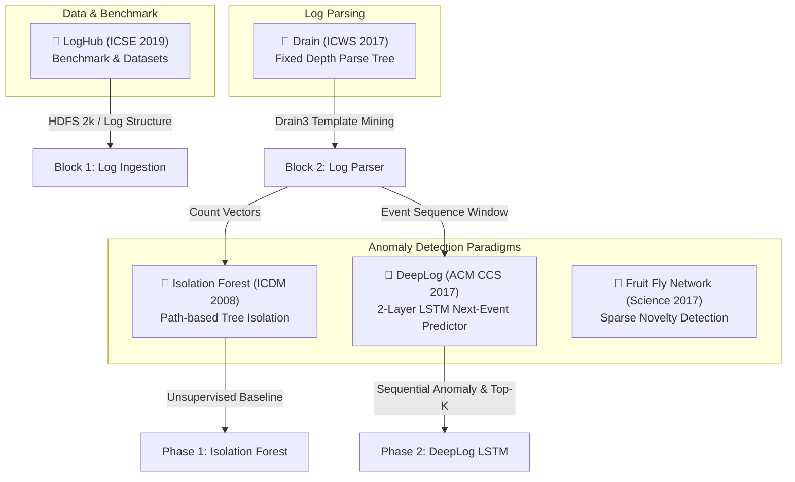
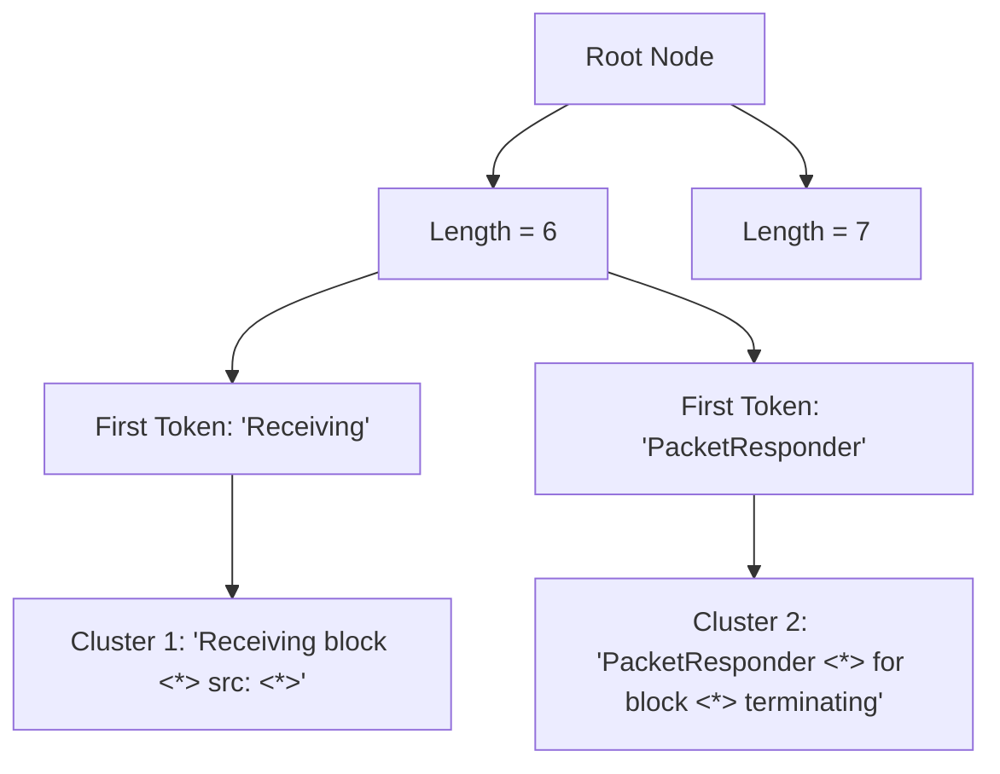

# 📚 เอกสารอ้างอิงงานวิจัย (Research References & Academic Foundations)

เอกสารรวบรวมงานวิจัยทางวิชาการ (Academic Papers) ที่ถูกนำมาใช้อ้างอิงในการออกแบบสถาปัตยกรรม, การคัดเลือกอัลกอริทึม, และการตัดสินใจเชิงเทคนิค (Technical Design Decisions) สำหรับระบบ **AI-based Log Anomaly Detection**

> [!NOTE] สัญลักษณ์และความเข้ากันได้กับ Obsidian
> เอกสารฉบับนี้ถูกจัดรูปแบบให้รองรับฟีเจอร์ของ **Obsidian** อย่างเต็มรูปแบบ ไม่ว่าจะเป็น Callout Blocks (`[!ABSTRACT]`, `[!NOTE]`, `[!TIP]`), Internal Links (`[[...]]`), Mermaid Diagrams, และ Tags เพื่อให้สามารถค้นหาและสร้าง Graph View ได้อย่างสมบูรณ์

---

## 🧭 สรุปภาพรวมความเชื่อมโยง (Research Mapping Matrix)

| งานวิจัย (Paper) | การประชุม / วารสาร | หมวดหมู่ในระบบ | จุดประเด็นทางเทคนิคที่นำมาใช้อ้างอิง (Technical Rationale) |
| :--- | :--- | :--- | :--- |
| **DeepLog** (Du et al., 2017) | ACM CCS 2017 | Deep Learning / Sequence Modeling | 1. โครงสร้าง **2-Layer LSTM** 2. การเลือก **Window Size** ($w=3$ ขจัดความคลุมเครือของ 1st-order Markov) 3. กลไก **Top-$K$ Candidates** เพื่อลด False Alarm 4. เหตุผลที่ส่งเฉพาะ $h_t$ ไม่ส่ง $C_t$ ข้าม Layer |
| **Drain** (He et al., 2017) | IEEE ICWS 2017 | Log Parsing / NLP | 1. โครงสร้าง **Fixed-Depth Parse Tree** ($O(1)$ ในการค้นหา Template) 2. การจัดกลุ่มด้วย **Prefix Token & Similarity Threshold** 3. แก้ปัญหา Parsing ช้าของ Drain เทียบกับ AEL / Spell / IPLoM |
| **Isolation Forest** (Liu et al., 2008) | IEEE ICDM 2008 | Machine Learning / Anomaly Detection | 1. แนวคิด **Few & Different** ในการตัดแต่ง Hyperplane 2. การ Sub-sampling ข้อมูลที่ **$256$ ตัวอย่าง** เพื่อแก้ Swamping และ Masking 3. ใช้เป็น Baseline Model สำหรับ Count Vector |
| **LogHub** (Zhu et al., 2019) | IEEE/ACM ICSE 2019 | Datasets / Benchmarking | 1. โครงสร้าง Log มาตรฐานของระบบ HDFS และ Block ID Correlation 2. Ground Truth สำหรับการวัดค่า Precision, Recall, F1-Score |
| **Fly Olfactory Circuit** (Dasgupta et al., 2017) | Science 2017 | Bio-inspired AI / Novelty Detection | 1. Random Projection ขยายมิติ (Mushroom Body) 2. Winner-Take-All Sparse Hashing สำหรับตรวจจับสิ่งแปลกปลอมแบบประหยัดพลังงาน |

---

## 1. DeepLog: Anomaly Detection and Root Cause Analysis from System Logs through Deep Learning

#deep-learning #lstm #sequence-model #log-anomaly #acm-ccs

> [!ABSTRACT] ข้อมูลบรรณานุกรม (Citation)
> - **ชื่อบทความ:** DeepLog: Anomaly Detection and Root Cause Analysis from System Logs through Deep Learning
> - **ผู้แต่ง:** Min Du, Feifei Li, Guineng Zheng, Vivek Srikumar (School of Computing, University of Utah)
> - **ตีพิมพ์ใน:** *Proceedings of the 2017 ACM SIGSAC Conference on Computer and Communications Security (ACM CCS 2017)*, Dallas, TX, USA, pp. 1285–1298.
> - **DOI / ลิงก์:** [10.1145/3133956.3134015](https://doi.org/10.1145/3133956.3134015)

### 📌 ประเด็นสำคัญที่ถูกนำมาใช้อ้างอิงในโปรเจกต์นี้

#### 1. ทำไมถึงเลือกสถาปัตยกรรม LSTM 2 เลเยอร์ (Why 2-Layer LSTM?)
- **การทดลองจริงในงานวิจัย:** คณะผู้วิจัยของ DeepLog ได้ทำการทดลองเปรียบเทียบจำนวนเลเยอร์ $L \in \{1, 2, 3, 4\}$:
  - **$L=1$:** เก็บได้เพียงความสัมพันธ์แบบตื้น (Shallow Context) โมเดลแยกแยะ Sequence ที่มีความซับซ้อนไม่ได้ดีพอ
  - **$L=2$:** ให้ประสิทธิภาพสูงสุด (Peak F1-score) โดย Layer 1 ทำหน้าที่สกัด **Local State Transitions** ($e_t \rightarrow e_{t+1}$) และ Layer 2 รวมสัญญาณกลายเป็น **Global Execution Pattern**
  - **$L \ge 3$:** ประสิทธิภาพไม่เพิ่มขึ้นอย่างมีนัยสำคัญ แต่เกิดปัญหา Overfitting บน Log Vocabulary ขนาดเล็ก และเกิด Vertical Gradient Dispersion (การสลายตัวของ Gradient ในแนวตั้ง)
- **การส่งผ่านสถานะระหว่างเลเยอร์ ($h_t$ vs $C_t$):**
  - Cell State ($C_t$) คือ **Constant Error Carousel (CEC)** วิ่งตามแนวนอนข้ามแกนเวลา (Time Step) เท่านั้น เพื่อรักษาสัญญาณระยะยาวไม่ให้ Vanish
  - Hidden State ($h_t = o_t \odot \tanh(C_t)$) คือข้อมูลที่ผ่านการกรองและบีบอัดให้อยู่ในขอบเขต $(-1, 1)$ จึงทำหน้าที่เป็น **Input Vector** ส่งให้ Layer ถัดไปในแนวตั้ง

#### 2. ทำไมถึงกำหนด Window Size เป็น 3 (Why Window Size = 3?)
- **แก้ปัญหาความคลุมเครือของ 1st-order Markov ($w=1$):** ในระบบจริง เหตุการณ์เดียวกันสามารถเกิดซ้ำในหลายบริบทได้ เช่น เหตุการณ์ `PacketResponder terminating` สามารถตามหลังได้ทั้ง `Verification succeeded` และ `Verification failed` หากใช้ $w=1$ โมเดลจะไม่สามารถทำนายได้ว่าอะไรจะเกิดขึ้นถัดไป
- **เหตุผลที่ไม่ใช้ Window กว้างเกินไป ($w > 10$):** งานวิจัย DeepLog ชี้ว่า Log Execution Path มีลักษณะเป็นกระบวนการที่มีความเฉพาะเจาะจงเฉพาะช่วงสั้นๆ การใช้ Window ยาวเกินไปทำให้ต้อง Padding ข้อมูลเยอะขึ้นเมื่อเจอ Task สั้นๆ และทำให้ Latency ในการประมวลผลแบบ Real-time สูงขึ้นโดยไม่จำเป็น

#### 3. กลไกการตรวจจับความผิดปกติแบบ Top-$K$ Candidates
- DeepLog ไม่ได้ตัดสิน Anomaly จากการที่ Next Event ต้องตรงกับคลาสที่มีความน่าจะเป็นอันดับ 1 เป๊ะๆ
- แต่จะถือว่า Log นั้น **"ปกติ"** หากสิ่งที่เกิดขึ้นจริง ติดอยู่ในกลุ่ม **Top-$K$ Candidates** ที่น่าจะเป็นไปได้มากที่สุด (ในโปรเจกต์เรากำหนด $K=1$ สำหรับ Mock และ $K \in [3, 9]$ ในระบบขนาดใหญ่)

---

## 2. Drain: An Online Log Parsing Approach with Fixed Depth Tree

#log-parsing #drain #fixed-depth-tree #ieee-icws #nlp

> [!ABSTRACT] ข้อมูลบรรณานุกรม (Citation)
> - **ชื่อบทความ:** Drain: An Online Log Parsing Approach with Fixed Depth Tree
> - **ผู้แต่ง:** Pinjia He, Jieming Zhu, Zibin Zheng, Michael R. Lyu (The Chinese University of Hong Kong)
> - **ตีพิมพ์ใน:** *2017 IEEE International Conference on Web Services (IEEE ICWS 2017)*, Honolulu, HI, USA, pp. 33–40.
> - **DOI / ลิงก์:** [10.1109/ICWS.2017.13](https://doi.org/10.1109/ICWS.2017.13)

### 📌 ประเด็นสำคัญที่ถูกนำมาใช้อ้างอิงในโปรเจกต์นี้

#### 1. สถาปัตยกรรม Fixed-Depth Parse Tree ($Depth = 4$)
งานวิจัย Drain ออกแบบโครงสร้างต้นไม้ที่มีความลึกคงที่เพื่อจำกัด Search Space ในการจับคู่ Log กับ Template:
1. **Root Node:** จุดเริ่มต้น
2. **Layer 1 (Log Length):** แยกประเภท Log ตามจำนวน Token หลังการ Masking
3. **Layer 2 (First Token):** แยกตามคำแรกสุดของ Log (เพราะคำแรกมักเป็น Subject หรือ Component เช่น `Receiving`, `PacketResponder`)
4. **Layer 3 (Internal Path):** แยกย่อยเพิ่มเติมตาม Token ตำแหน่งถัดไป
5. **Leaf Nodes (Log Clusters):** จัดเก็บ Log Template จริง เพื่อทำการเปรียบเทียบ Token Similarity

#### 2. ประสิทธิภาพเชิงคำนวณ (Computational Efficiency)
- อัลกอริทึมรุ่นก่อนหน้า เช่น **Spell** (Longest Common Subsequence) หรือ **IPLoM** ต้องค้นหาแบบจับคู่ทุกคู่ ซึ่งมีความซับซ้อนระดับ $O(N \cdot M)$
- Drain ใช้คุณสมบัติ Prefix Matching ทำให้ลดเวลาค้นหาลงเหลือแทบจะเป็น **$O(1)$ ถึง $O(k)$** (โดย $k$ คือจำนวน Cluster ใน Leaf Node เดียวกัน) จึงเหมาะอย่างยิ่งสำหรับงาน Streaming Log ใน CI/CD Pipeline

---

## 3. Isolation Forest

#machine-learning #unsupervised #anomaly-detection #decision-tree #ieee-icdm

> [!ABSTRACT] ข้อมูลบรรณานุกรม (Citation)
> - **ชื่อบทความ:** Isolation Forest
> - **ผู้แต่ง:** Fei Tony Liu, Kai Ming Ting, Zhi-Hua Zhou (Monash University & Nanjing University)
> - **ตีพิมพ์ใน:** *Eighth IEEE International Conference on Data Mining (IEEE ICDM 2008)*, Pisa, Italy, pp. 413–422.
> - **DOI / ลิงก์:** [10.1109/ICDM.2008.17](https://doi.org/10.1109/ICDM.2008.17)

### 📌 ประเด็นสำคัญที่ถูกนำมาใช้อ้างอิงในโปรเจกต์นี้

#### 1. หลักการ "Few and Different"
- โมเดลตรวจจับความผิดปกติส่วนใหญ่ในอดีต (เช่น One-Class SVM, LOF, GMM) พยายามสร้างขอบเขตของ "ข้อมูลปกติ" (Profile Normal Points) ซึ่งใช้ทรัพยากรสูงและมีปัญหาเรื่อง Curse of Dimensionality
- Isolation Forest พลิกมุมมองโดยมุ่งเน้น **"การแยกเดี่ยว" (Isolation)**: เนื่องจากจุด Anomaly มีจำนวนน้อย (Few) และมีคุณลักษณะแตกต่างอย่างชัดเจน (Different) การสุ่มตัดระนาบ (Random Splitting) จึงสามารถแยกจุดเหล่านี้ออกมาได้ที่ความลึกของกิ่งไม้ (Tree Depth) ต่ำกว่าข้อมูลปกติอย่างเห็นได้ชัด

#### 2. สูตรการคำนวณคะแนนความผิดปกติ (Anomaly Score)
คะแนน Anomaly Score $s(x, n)$ คำนวณจากความยาวเส้นทางเฉลี่ย $E(h(x))$ เทียบกับความยาวเส้นทางเฉลี่ยที่คาดหวังของต้นไม้ค้นหาทวิภาค $c(n)$:

$$s(x, n) = 2^{-\frac{E(h(x))}{c(n)}}$$

โดยที่:
$$c(n) = 2 \ln(n - 1) + 0.5772156649\ (\text{Euler's constant}) - \frac{2(n - 1)}{n}$$

- หาก $s \to 1$: ข้อมูลนั้นมีความผิดปกติสูง (Isolated อย่างรวดเร็ว)
- หาก $s < 0.5$: ข้อมูลนั้นจัดเป็นจุดปกติทั่วไป

#### 3. เทคนิค Sub-sampling Size = 256
- งานวิจัยพิสูจน์แล้วว่าการสุ่มขนาดตัวอย่างเพียง **256 ตัวอย่างต่อต้นไม้** ไม่เพียงแต่ลดเวลาการสร้างต้นไม้ลงมหาศาล แต่ยังช่วยป้องกันปัญหาสำคัญ 2 ประการ:
  1. **Swamping:** จุดปกติถูกจัดว่าผิดปกติ เพราะมีจุดปกติอื่นอยู่เบาบางรอบข้าง
  2. **Masking:** จุดผิดปกติอยู่รวมกันเป็นกลุ่มเล็กๆ ทำให้โมเดลตัดแยกไม่ได้ถ้าไม่ Sub-sample

---

## 4. Tools and Benchmarks for Automated Log Analysis (LogHub & LogPAI)

#log-analysis #loghub #benchmark #datasets #software-engineering

> [!ABSTRACT] ข้อมูลบรรณานุกรม (Citation)
> - **ชื่อบทความ:** Tools and Benchmarks for Automated Log Analysis
> - **ผู้แต่ง:** Jieming Zhu, Shilin He, Pinjia He, Jinyang Liu, Michael R. Lyu (The Chinese University of Hong Kong)
> - **ตีพิมพ์ใน:** *Proceedings of the 41st International Conference on Software Engineering: Companion Proceedings (IEEE/ACM ICSE 2019)*, Montreal, QC, Canada, pp. 121–124.
> - **Repository / Benchmark:** [LogHub GitHub](https://github.com/logpai/loghub) | [LogPAI Platform](https://logpai.github.io/)

### 📌 ประเด็นสำคัญที่ถูกนำมาใช้อ้างอิงในโปรเจกต์นี้

#### 1. แหล่งที่มาของชุดข้อมูล HDFS 2,000 บรรทัด
- โปรเจกต์ของเราดึงชุดข้อมูล `HDFS_2k.log` มาจาก LogHub เพื่อใช้เป็นมาตรฐานสากลในการพัฒนาและทดสอบ Unit Test
- โครงสร้างของข้อมูลมีทั้ง Timestamp, Process ID, Log Level, Component, Block ID (`blk_-1608999687919862906`), และข้อความดิบ
- มี Ground Truth สำหรับการประเมินความแม่นยำของโมเดล ทำให้โปรเจกต์สามารถวัดผลเทียบเคียงกับงานวิจัยระดับโลกได้

---

## 5. A Neural Algorithm for Fundamental Computing Problems (Fly Novelty Detection)

#bio-inspired #sparse-coding #random-projection #winner-take-all #science

> [!ABSTRACT] ข้อมูลบรรณานุกรม (Citation)
> - **ชื่อบทความ:** A neural algorithm for fundamental computing problems
> - **ผู้แต่ง:** Sanjoy Dasgupta, Charles F. Stevens, Saket Navlakha (Salk Institute for Biological Studies & UC San Diego)
> - **ตีพิมพ์ใน:** *Science*, Vol. 358, Issue 6364, 2017, pp. 793–796.
> - **DOI / ลิงก์:** [10.1126/science.aam9868](https://doi.org/10.1126/science.aam9868)

### 📌 ประเด็นสำคัญที่ถูกนำมาใช้อ้างอิงในโปรเจกต์นี้

#### 1. ชีววิทยาของการรับรู้กลิ่น (Olfactory Circuit of the Fruit Fly)
- สมองของแมลงวันทอง (Fruit Fly) ใช้เซลล์ประสาทกลุ่ม **Kenyon Cells (KC)** ใน Mushroom Body เพื่อขยายมิติสัญญาณกลิ่นจาก Projection Neurons (PN) ประมาณ 50 เซลล์ ไปยัง 2,000 เซลล์
- ใช้วงจรยับยั้ง (Inhibitory Circuit) คัดเลือกเฉพาะเซลล์ที่กระตุ้นแรงสุด 5% บนหลักการ **Winner-Take-All (WTA)** ทำให้ได้รหัสแฮชแบบเบาบาง (Sparse Hash Representation)

#### 2. ความเกี่ยวข้องกับ Novelty Detection และ Edge AI
- ถูกนำมาอ้างอิงเป็น **Alternative Paradigm** ในการทำ Anomaly / Novelty Detection สำหรับอุปกรณ์ขอบระเบียง (Edge Devices) หรือ Environment ที่มีข้อจำกัดด้านพลังงานคำนวณสูง
- ช่วยให้เห็นภาพว่าการตรวจจับความแปลกใหม่สามารถทำได้ด้วยโครงสร้างทางคณิตศาสตร์ที่ไม่ต้องพึ่งพา Backpropagation ขนาดใหญ่

---

## 🔗 ความสัมพันธ์ระหว่างเอกสารในโปรเจกต์ (Vault Internal Links)

- [[README]]: ภาพรวมโครงการและสารบัญหลัก
- [[PROJECT_ROADMAP]]: แผนงานและสถานะความคืบหน้ารายเฟส
- [[SYSTEM_ARCHITECTURE]]: ไดอะแกรมสถาปัตยกรรมและรายละเอียดทางเทคนิคของระบบ
