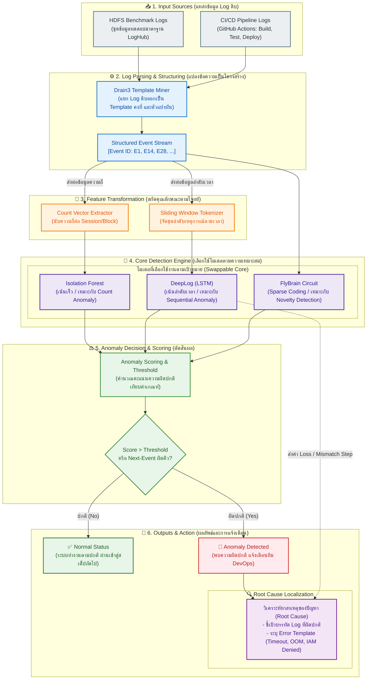

# สถาปัตยกรรมระบบ AI-based Log Anomaly Detection (System Architecture)

> [!NOTE] วัตถุประสงค์ของเอกสาร
> เอกสารฉบับนี้จัดทำขึ้นเพื่อแสดง **ลำดับและโครงสร้างการทำงานจริงของโปรเจกต์** ในรูปแบบผังสถาปัตยกรรมแบบบล็อกแนวตั้ง (Architectural Block Diagram Style คล้ายผังโครงสร้างของเปเปอร์ AI มาตรฐานระดับสากล) และแสดง **โครงสร้างแบบตัวต่อเลโก้ (Lego Modular Architecture)** เพื่อให้สามารถพัฒนาแยกส่วนและนำมาประกอบกันได้อย่างเป็นระเบียบ โดยรองรับการเปิดอ่านและเรนเดอร์กราฟิกผ่านโปรแกรม **Obsidian**

---

## 1. ผังสถาปัตยกรรมลำดับการทำงานของระบบ (End-to-End System Workflow)

ผังนี้แสดงการไหลของข้อมูลตั้งแต่ข้อมูลดิบด้านล่าง (Inputs) ผ่านชั้นการประมวลผลและการเลือกใช้โมเดลที่เหมาะสมที่สุดตามโจทย์ จนถึงผลลัพธ์การตรวจจับและชี้เป้าปัญหาด้านบน (Outputs):

---

## 2. สถาปัตยกรรมแบบตัวต่อเลโก้ (Lego Modular Architecture)

เพื่อให้การพัฒนาระบบสามารถทำแยกชิ้นส่วนกันได้อย่างอิสระ แต่ละส่วนจะมี **Standard Interface (ข้อต่อมาตรฐาน)** กำกับไว้ สามารถสลับเปลี่ยนอัลกอริทึมได้โดยไม่กระทบกับส่วนอื่นของระบบ:

```mermaid
flowchart LR
    classDef b1 fill:#e3f2fd,stroke:#1565c0,stroke-width:2px;
    classDef b2 fill:#fff3e0,stroke:#e65100,stroke-width:2px;
    classDef b3 fill:#e8f5e9,stroke:#2e7d32,stroke-width:2px;
    classDef b4 fill:#fce4ec,stroke:#c2185b,stroke-width:2px;
    classDef b5 fill:#f3e5f5,stroke:#7b1fa2,stroke-width:2px;

    subgraph Brick1["🧱 Block 1: Ingestion"]
        L1["HDFSLoader"]
        L2["GitHubActionsLoader"]
        L3["MockLogGenerator"]
    end
    class Brick1 b1;

    subgraph Brick2["🧱 Block 2: Parser"]
        P1["Drain3Parser"]
        P2["RegexParser"]
    end
    class Brick2 b2;

    subgraph Brick3["🧱 Block 3: Feature Extractor"]
        F1["CountVectorBuilder"]
        F2["SequenceTokenizer"]
    end
    class Brick3 b3;

    subgraph Brick4["🧱 Block 4: Anomaly Model"]
        M1["IsolationForestModel"]
        M2["DeepLogLSTMModel"]
        M3["FlyBrainModel"]
    end
    class Brick4 b4;

    subgraph Brick5["🧱 Block 5: Explainer & Alert"]
        E1["RootCauseLocator"]
        E2["AlertDispatcher (Slack/PR)"]
    end
    class Brick5 b5;

    Brick1 == "Iterator[RawLog]" ==> Brick2
    Brick2 == "List[ParsedEvent]" ==> Brick3
    Brick3 == "Feature Tensors / Vectors" ==> Brick4
    Brick4 == "AnomalyResult" ==> Brick5
```

---

## 3. สรุปข้อต่อมาตรฐาน (Standard Interfaces สำหรับนักพัฒนา)

| เลโก้บล็อก             | ชื่อ Interface หลัก    | Method ที่ต้องมี                  | Output ที่ส่งต่อให้บล็อกถัดไป                 |
| :--------------------- | :--------------------- | :-------------------------------- | :-------------------------------------------- |
| **Block 1: Ingestion** | `BaseLogLoader`        | `load() -> Iterator[str]`         | ข้อความ Log ดิบทีละบรรทัด                     |
| **Block 2: Parser**    | `BaseLogParser`        | `parse(line: str) -> Event`       | รหัส Event ID และ Parameters                  |
| **Block 3: Feature**   | `BaseFeatureExtractor` | `fit_transform(events) -> Matrix` | Matrix ตัวเลข / ลำดับ Sequence สำหรับโมเดล    |
| **Block 4: Model**     | `BaseAnomalyModel`     | `fit(X)`, `predict(X) -> Result`  | คะแนนความผิดปกติ (Anomaly Score) และป้ายกำกับ |
| **Block 5: Explainer** | `BaseExplainer`        | `explain(Result) -> Report`       | บรรทัด Log ต้นเหตุ และคำอธิบายความผิดปกติ     |

> [!TIP] ประโยชน์ของการออกแบบลักษณะนี้
> 1. **เริ่มง่าย (Phase 1 Baseline):** สามารถเริ่มต้นด้วยการประกอบ `HDFSLoader` + `Drain3Parser` + `CountVectorBuilder` + `IsolationForestModel` เข้าด้วยกันเพื่อทำ Baseline ให้เสร็จอย่างรวดเร็ว
> 2. **ยกระดับง่าย (Phase 2 CI/CD):** เมื่อต้องการทำ Sequential Anomaly ก็เพียงแค่เปลี่ยนชิ้นส่วน `Feature` เป็น `SequenceTokenizer` และเปลี่ยน `Model` เป็น `DeepLogLSTMModel` โดยที่ส่วนอื่นยังคงใช้งานร่วมกันได้
> 3. **ทดลองสิ่งใหม่ได้อิสระ:** หากต้องการทดสอบอัลกอริทึมจำพวก Bio-inspired (เช่น สมองแมลงวัน) ก็เพียงแค่สร้าง Class `FlyBrainModel` มาเสียบใน Block 4 ได้ทันที
