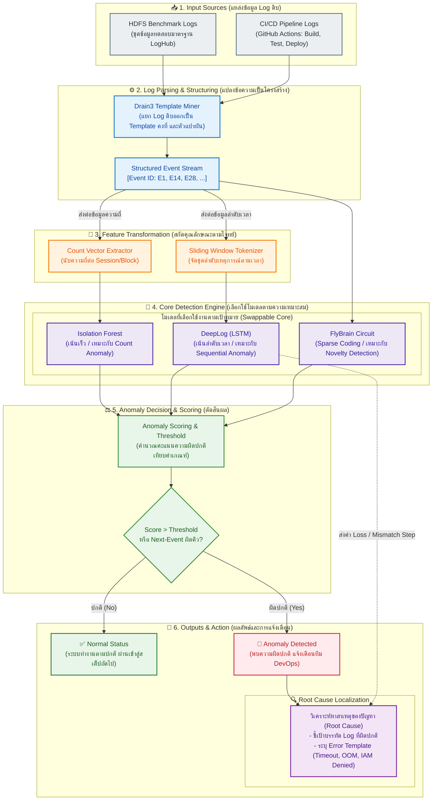
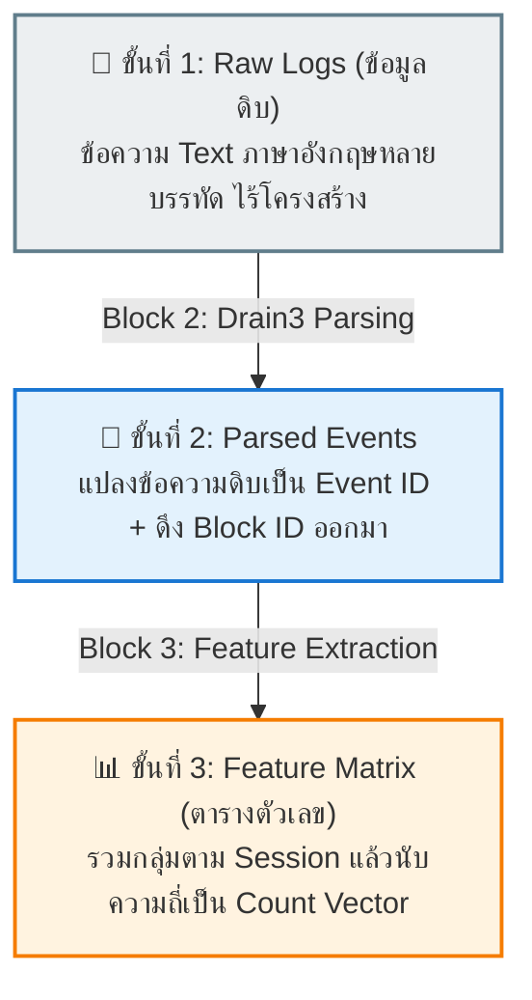
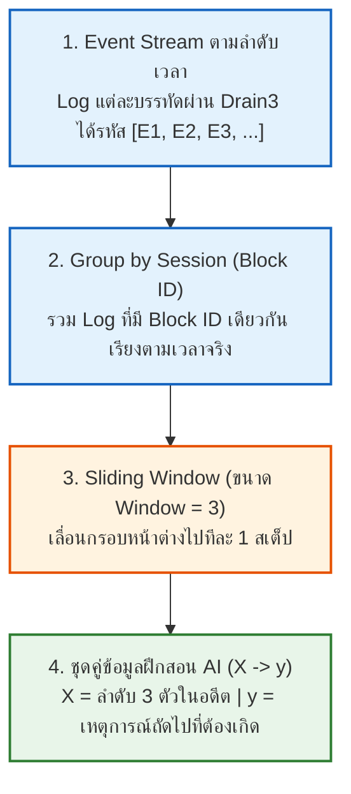

# สถาปัตยกรรมระบบ AI-based Log Anomaly Detection (System Architecture)

> [!NOTE] วัตถุประสงค์ของเอกสาร
> เอกสารฉบับนี้จัดทำขึ้นเพื่อแสดง **ลำดับและโครงสร้างการทำงานจริงของโปรเจกต์** ในรูปแบบผังสถาปัตยกรรมแบบบล็อกแนวตั้ง (Architectural Block Diagram Style คล้ายผังโครงสร้างของเปเปอร์ AI มาตรฐานระดับสากล) และแสดง **โครงสร้างแบบตัวต่อเลโก้ (Lego Modular Architecture)** เพื่อให้สามารถพัฒนาแยกส่วนและนำมาประกอบกันได้อย่างเป็นระเบียบ โดยรองรับการเปิดอ่านและเรนเดอร์กราฟิกผ่านโปรแกรม **Obsidian**

---

## 1. ผังสถาปัตยกรรมลำดับการทำงานของระบบ (End-to-End System Workflow)

ผังนี้แสดงการไหลของข้อมูลตั้งแต่ข้อมูลดิบด้านล่าง (Inputs) ผ่านชั้นการประมวลผลและการเลือกใช้โมเดลที่เหมาะสมที่สุดตามโจทย์ จนถึงผลลัพธ์การตรวจจับและชี้เป้าปัญหาด้านบน (Outputs):



---

## 2. สถาปัตยกรรมแบบตัวต่อเลโก้ (Lego Modular Architecture)

เพื่อให้การพัฒนาระบบสามารถทำแยกชิ้นส่วนกันได้อย่างอิสระ แต่ละส่วนจะมี **Standard Interface (ข้อต่อมาตรฐาน)** กำกับไว้ สามารถสลับเปลี่ยนอัลกอริทึมได้โดยไม่กระทบกับส่วนอื่นของระบบ:

```mermaid
flowchart LR
    classDef b1 fill:#e3f2fd,stroke:#1565c0,stroke-width:2px;
    classDef b2 fill:#fff3e0,stroke:#e65100,stroke-width:2px;
    classDef b3 fill:#e8f5e9,stroke:#2e7d32,stroke-width:2px;
    classDef b4 fill:#fce4ec,stroke:#c2185b,stroke-width:2px;
    classDef b5 fill:#f3e5f5,stroke:#7b1fa2,stroke-width:2px;

    subgraph Brick1["🧱 Block 1: Ingestion"]
        L1["HDFSLoader"]
        L2["GitHubActionsLoader"]
        L3["MockLogGenerator"]
    end
    class Brick1 b1;

    subgraph Brick2["🧱 Block 2: Parser"]
        P1["Drain3Parser"]
        P2["RegexParser"]
    end
    class Brick2 b2;

    subgraph Brick3["🧱 Block 3: Feature Extractor"]
        F1["CountVectorBuilder"]
        F2["SequenceTokenizer"]
    end
    class Brick3 b3;

    subgraph Brick4["🧱 Block 4: Anomaly Model"]
        M1["IsolationForestModel"]
        M2["DeepLogLSTMModel"]
        M3["FlyBrainModel"]
    end
    class Brick4 b4;

    subgraph Brick5["🧱 Block 5: Explainer & Alert"]
        E1["RootCauseLocator"]
        E2["AlertDispatcher (Slack/PR)"]
    end
    class Brick5 b5;

    Brick1 == "Iterator[RawLog]" ==> Brick2
    Brick2 == "List[ParsedEvent]" ==> Brick3
    Brick3 == "Feature Tensors / Vectors" ==> Brick4
    Brick4 == "AnomalyResult" ==> Brick5
```



---

## 3. สรุปข้อต่อมาตรฐาน (Standard Interfaces สำหรับนักพัฒนา)

| เลโก้บล็อก             | ชื่อ Interface หลัก    | Method ที่ต้องมี                  | Output ที่ส่งต่อให้บล็อกถัดไป                 |
| :--------------------- | :--------------------- | :-------------------------------- | :-------------------------------------------- |
| **Block 1: Ingestion** | `BaseLogLoader`        | `load() -> Iterator[str]`         | ข้อความ Log ดิบทีละบรรทัด                     |
| **Block 2: Parser**    | `BaseLogParser`        | `parse(line: str) -> Event`       | รหัส Event ID และ Parameters                  |
| **Block 3: Feature**   | `BaseFeatureExtractor` | `fit_transform(events) -> Matrix` | Matrix ตัวเลข / ลำดับ Sequence สำหรับโมเดล    |
| **Block 4: Model**     | `BaseAnomalyModel`     | `fit(X)`, `predict(X) -> Result`  | คะแนนความผิดปกติ (Anomaly Score) และป้ายกำกับ |
| **Block 5: Explainer** | `BaseExplainer`        | `explain(Result) -> Report`       | บรรทัด Log ต้นเหตุ และคำอธิบายความผิดปกติ     |

> [!TIP] ประโยชน์ของการออกแบบลักษณะนี้
> 1. **เริ่มง่าย (Phase 1 Baseline):** สามารถเริ่มต้นด้วยการประกอบ `HDFSLoader` + `Drain3Parser` + `CountVectorBuilder` + `IsolationForestModel` เข้าด้วยกันเพื่อทำ Baseline ให้เสร็จอย่างรวดเร็ว
> 2. **ยกระดับง่าย (Phase 2 CI/CD):** เมื่อต้องการทำ Sequential Anomaly ก็เพียงแค่เปลี่ยนชิ้นส่วน `Feature` เป็น `SequenceTokenizer` และเปลี่ยน `Model` เป็น `DeepLogLSTMModel` โดยที่ส่วนอื่นยังคงใช้งานร่วมกันได้
> 3. **ทดลองสิ่งใหม่ได้อิสระ:** หากต้องการทดสอบอัลกอริทึมจำพวก Bio-inspired (เช่น สมองแมลงวัน) ก็เพียงแค่สร้าง Class `FlyBrainModel` มาเสียบใน Block 4 ได้ทันที

---

## 4. ตัวอย่างการแปลงข้อมูล: จากข้อมูลดิบ (Raw Data) สู่ Feature Matrix

ส่วนนี้แสดงการเปลี่ยนแปลงรูปทรงของข้อมูล (Data Transformation) ในแต่ละขั้นตอน เพื่อให้เห็นภาพชัดเจนว่าข้อมูลดิบหน้าตาแบบไหน และถูกสกัดออกมาเป็นตารางตัวเลขสำหรับ AI ได้อย่างไร:



---

### ขั้นที่ 1: ข้อมูลดิบที่เข้ามาจริง (Raw Logs Input จาก Block 1)
ข้อมูลจริงที่อ่านมาจากไฟล์ `data/raw/hdfs_sample.log` จะเป็นแค่ข้อความยาวๆ เรียงต่อกัน:

```text
# --- กลุ่มที่ 1: กิจกรรมของบล็อก blk_-1608999687919862906 (ปกติ) ---
081109 203615 148 INFO dfs.DataNode$DataXceiver: Receiving block blk_-1608999687919862906 src: /10.250.19.102:54106 dest: /10.250.19.102:50010
081109 203620 23 INFO dfs.FSNamesystem: BLOCK* NameSystem.allocateBlock: /mnt/hadoop/mapred/system/job.jar. blk_-1608999687919862906
081109 203622 148 INFO dfs.DataNode$PacketResponder: PacketResponder blk_-1608999687919862906 1 received
081109 203624 148 INFO dfs.DataNode$PacketResponder: PacketResponder blk_-1608999687919862906 2 terminating
081109 203625 13 INFO dfs.FSNamesystem: BLOCK* NameSystem.addStoredBlock: blockMap updated: 10.250.19.102:50010 is added to blk_-1608999687919862906 size 91178
081109 203630 148 INFO dfs.DataNode$DataXceiver: 10.250.19.102:50010 Served block blk_-1608999687919862906 to /10.250.19.102:54106

# --- กลุ่มที่ 2: กิจกรรมของบล็อก blk_999999999999999999 (ผิดปกติ / มี Error) ---
081109 204000 160 INFO dfs.DataNode$DataXceiver: Receiving block blk_999999999999999999 src: /10.250.19.102:54106 dest: /10.250.19.102:50010
081109 204001 160 ERROR dfs.DataNode$DataXceiver: Unexpected error trying to delete block blk_999999999999999999. BlockInfo not found in volumeMap.
081109 204002 160 WARN dfs.DataNode$DataXceiver: Verification failed for blk_999999999999999999 checksum mismatch
```

> **ปัญหาของข้อมูลดิบ:** มีความยาวไม่เท่ากัน, ตัวเลข IP และ Timestamp เปลี่ยนตลอดเวลา AI ไม่สามารถนำไปบวกลบคูณหารตรงๆ ได้

---

### ขั้นที่ 2: ผลลัพธ์หลังผ่าน Block 2 (Parsed Events)
Drain3 จะสกัดเอาตัวแปรออก แล้วแทนที่ด้วยแม่แบบคงที่ (Template) พร้อมแจก **Event ID (E1, E2, ...)**:

- `E1` = `Receiving block <*> src: <*> dest: <*>`
- `E2` = `BLOCK* NameSystem.allocateBlock: <*> <*>`
- `E3` = `PacketResponder <*> <*> terminating / received`
- `E4` = `BLOCK* NameSystem.addStoredBlock: blockMap updated: <*> is added to <*> size <*>`
- `E5` = `<*> Served block <*> to <*>`
- `E6` = `ERROR Unexpected error trying to delete block <*>` *(เหตุการณ์ Error)*
- `E7` = `WARN Verification failed for <*> checksum mismatch` *(เหตุการณ์ Warning)*

---

### ขั้นที่ 3: ผลลัพธ์หลังผ่าน Block 3 (Feature Matrix / Count Vector)
Block 3 จะนำ Log ที่มี **Block ID เดียวกัน** มารวมกลุ่มเป็น 1 แถว (1 Session) แล้วนับว่าแต่ละ Event เกิดขึ้นกี่ครั้ง:

| Block ID (Session Key) | E1 (Receive) | E2 (Allocate) | E3 (Responder) | E4 (AddStored) | E5 (Served) | E6 (DeleteErr) | E7 (ChecksumErr) | สถานะจริง (Ground Truth) |
| :--- | :---: | :---: | :---: | :---: | :---: | :---: | :---: | :---: |
| `blk_-1608999...` | **1** | **1** | **2** | **1** | **1** | **0** | **0** | ✅ **Normal** |
| `blk_7503483...` | **1** | **0** | **2** | **1** | **1** | **0** | **0** | ✅ **Normal** |
| `blk_3587508...` | **1** | **0** | **2** | **1** | **0** | **0** | **0** | ✅ **Normal** |
| `blk_9999999...` | **1** | **0** | **0** | **0** | **0** | **1** | **1** | 🚨 **Anomaly** |

---

### 💡 จุดที่ทำให้โมเดล AI (Isolation Forest) รู้ว่าแถวไหนผิดปกติ:
1. **กลุ่มปกติ (Normal Rows):** ตัวเลขในคอลัมน์ `E1` ถึง `E5` จะมีค่าปกติสม่ำเสมอ และในคอลัมน์ `E6` กับ `E7` จะเป็น **0 ทั้งหมด**
2. **กลุ่มผิดปกติ (Anomaly Row):** ในแถวของ `blk_9999999...` ตัวเลขในเหตุการณ์ปกติแทบไม่มี แต่กลับมีตัวเลขโผล่ขึ้นมาในคอลัมน์ **`E6` = 1** และ **`E7` = 1**
3. **เมื่อโยนตารางนี้ให้ AI:** โมเดลจะตรวจจับเวกเตอร์ `[1, 0, 0, 0, 0, 1, 1]` ว่าเป็นจุดข้อมูลที่อยู่ห่างไกลจากเพื่อนๆ (Outlier) และชี้เป้าว่าเป็น **Anomaly ทันที!**

---

## 5. การสกัด Feature ลำดับเวลา (Sequential Feature: Sliding Window สำหรับ DeepLog / LSTM)

สำหรับ **Phase 2 (Sequential Anomaly)** เราไม่สามารถใช้การนับความถี่ (Count Vector) ได้ เพราะการนับความถี่ไม่สนใจลำดับก่อน-หลัง โมดูล `SequenceExtractor` จึงถูกสร้างขึ้นมาเพื่อแปลง Log ให้เป็น **"คู่ลำดับเวลา (Input X $\rightarrow$ Target y)"** โดยมีกระบวนการทำงานดังนี้:



---

### เจาะลึกการเลื่อนหน้าต่าง (Sliding Window Mechanism)

สมมติบล็อก `blk_-1608999...` มีประวัติการทำงานเรียงตามเวลาจริงคือ:
$$\text{Sequence} = [E1, E2, E3, E3, E4, E5]$$

เมื่อกำหนดขนาดหน้าต่าง **`window_size = 3`** หน้าต่างจะเลื่อนไปทีละก้าวเพื่อสร้างคู่ข้อมูลสอน AI ดังนี้:

```text
[ ก้าวที่ 1 ]:  [ E1 , E2 , E3 ]  ──ทายตัวถัดไป──>  E3
                 └─────┬─────┘                       │
                    Input (X)                    Target (y)

[ ก้าวที่ 2 ]:       [ E2 , E3 , E3 ]  ──ทายตัวถัดไป──>  E4
                      └─────┬─────┘                       │
                         Input (X)                    Target (y)

[ ก้าวที่ 3 ]:            [ E3 , E3 , E4 ]  ──ทายตัวถัดไป──>  E5
                           └─────┬─────┘                       │
                              Input (X)                    Target (y)
```

---

### โครงสร้างข้อมูลจริงหลังผ่าน `SequenceExtractor`

ตารางสรุปคู่ข้อมูล `(X, y)` ที่ถูกแปลงเป็น Numpy Array และ Tensor พร้อมส่งเข้าสู่ **LSTM Neural Network**:

| ที่มา (Session / Block ID) | หน้าต่างในอดีต: Input ($X$) | คำตอบที่ต้องทาย: Target ($y$) | ความหมายเชิงบริบทของระบบ                                               |
| :------------------------- | :-------------------------: | :---------------------------: | :--------------------------------------------------------------------- |
| `blk_-1608999...` (ก้าว 1) |       `[ 1 , 2 , 3 ]`       |            **`3`**            | *"หลัง Receive (1) และ Allocate (2) ตัว Responder (3) ต้องเริ่มทำงาน"* |
| `blk_-1608999...` (ก้าว 2) |       `[ 2 , 3 , 3 ]`       |            **`4`**            | *"หลัง Responder ทำงานเสร็จ (3) สเต็ป AddStoredBlock (4) ต้องตามมา"*   |
| `blk_-1608999...` (ก้าว 3) |       `[ 3 , 3 , 4 ]`       |            **`5`**            | *"หลังบันทึก Block สำเร็จ (4) ต้องเกิดสเต็ป Served Block (5)"*         |
| `blk_7503483...` (ก้าว 1)  |       `[ 1 , 3 , 3 ]`       |            **`4`**            | รูปแบบปกติอีกเส้นทางหนึ่ง                                              |
| `blk_7503483...` (ก้าว 2)  |       `[ 3 , 3 , 4 ]`       |            **`5`**            | สอดคล้องกับพฤติกรรมปกติ                                                |

---

### 🚨 จุดที่ Neural Network (DeepLog) จะสั่งเตือน Anomaly

เมื่อนำโมเดลที่เรียนรู้ลำดับปกตินี้ไปตรวจจับ Log ใหม่:
- หากระบบส่งประวัติเข้ามาว่า: `Input = [1, 2, 3]`
- โมเดล LSTM จะทำนายว่า Event ถัดไปควรเป็น **Top-Candidates: `[3, 4]`**
- **แต่ถ้าในระบบจริง Event ถัดไปกลับกลายเป็น `E6 (Error)` หรือ `E5 (ข้ามสเต็ป)`**
  $$\text{Next Event } (E6) \notin \text{Top-Candidates } [3, 4] \implies \mathbf{🚨 \text{Sequential Anomaly!}}$$


