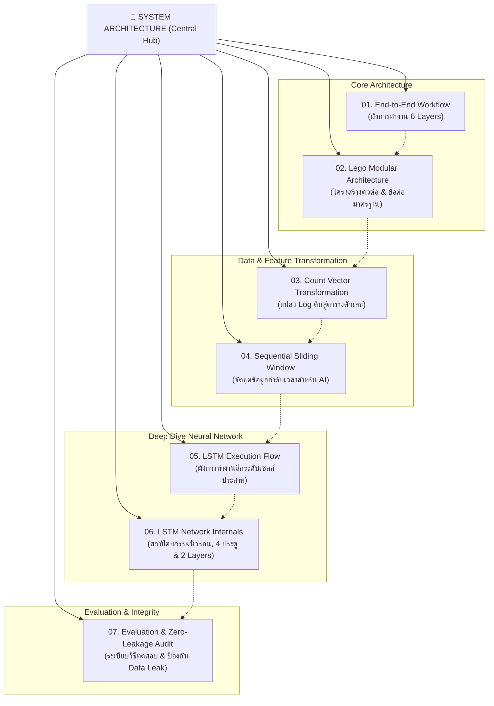

# 📐 สถาปัตยกรรมระบบ (System Architecture Map of Content)

> [!NOTE] ภาพรวมและวัตถุประสงค์
> เอกสารฉบับนี้ทำหน้าที่เป็น **ศูนย์กลางการนำทาง (Map of Content / Hub)** สำหรับสถาปัตยกรรมระบบ **AI-based Log Anomaly Detection** โดยเนื้อหาเชิงลึกแต่ละด้านถูกแยกออกเป็นไฟล์เฉพาะเรื่องในโฟลเดอร์ [`system_architecture/`](system_architecture/) เพื่อความสะดวกในการอ่าน ค้นหา และสร้าง Graph View ใน **Obsidian**

---

## 🗺️ แผนผังนำทางสถาปัตยกรรมระบบ (Architecture Navigation Map)

---

## 📚 สารบัญหัวข้อสถาปัตยกรรมระบบ (Topic Breakdown)

### 1. [01. ผังสถาปัตยกรรมลำดับการทำงานของระบบ (End-to-End System Workflow)](system_architecture/01_end_to_end_workflow.md)
- **ไฟล์:** `system_architecture/01_end_to_end_workflow.md` (หรือ `[[01_end_to_end_workflow]]`)
- **เนื้อหาหลัก:**
  - ผังสถาปัตยกรรมแบบบล็อกแนวตั้งตามมาตรฐานเปเปอร์ AI สากล (Mermaid Diagram)
  - รายละเอียดของแต่ละชั้นการทำงานตั้งแต่ **Layer 0 (Input Sources)** ถึง **Layer 5 (Outputs & Root Cause Localization)**
  - การไหลของข้อมูลและการเชื่อมประสานระหว่าง Ingestion, Parser, Feature, Model, และ Alert

---

### 2. [02. สถาปัตยกรรมแบบตัวต่อเลโก้และข้อต่อมาตรฐาน (Lego Modular Architecture)](system_architecture/02_lego_modular_architecture.md)
- **ไฟล์:** `system_architecture/02_lego_modular_architecture.md` (หรือ `[[02_lego_modular_architecture]]`)
- **เนื้อหาหลัก:**
  - แนวคิดสถาปัตยกรรมตัวต่อเลโก้ (Lego Modularity) ที่แยกส่วนอิสระและเปลี่ยนโมเดลได้ทันที (Swappable Engine)
  - ตารางข้อต่อมาตรฐาน (**Standard Interfaces**) สำหรับนักพัฒนา: `BaseLogLoader`, `BaseLogParser`, `BaseFeatureExtractor`, `BaseAnomalyModel`, `BaseExplainer`
  - แนวทางการต่อยอดจาก Phase 1 Baseline ไปสู่ Phase 2 CI/CD และการเสียบโมเดลทดลองใหม่ๆ (เช่น Bio-inspired FlyBrain)

---

### 3. [03. การแปลงข้อมูลดิบสู่ Feature Matrix (Count Vector สำหรับ Isolation Forest)](system_architecture/03_count_vector_transformation.md)
- **ไฟล์:** `system_architecture/03_count_vector_transformation.md` (หรือ `[[03_count_vector_transformation]]`)
- **เนื้อหาหลัก:**
  - ตัวอย่างการแปลงข้อมูล 3 ขั้นตอน: Raw Logs $\rightarrow$ Drain3 Parsed Events $\rightarrow$ Session Count Vector
  - เปรียบเทียบข้อมูลจริงระหว่างกลุ่มปกติ (Normal) กับกลุ่มผิดปกติ (Anomaly)
  - กลไกทางคณิตศาสตร์ที่ทำให้ **Isolation Forest** แยกแยะ Outlier Vector ได้อย่างรวดเร็ว

---

### 4. [04. การสกัด Feature ลำดับเวลา (Sliding Window สำหรับ DeepLog / LSTM)](system_architecture/04_sequential_sliding_window.md)
- **ไฟล์:** `system_architecture/04_sequential_sliding_window.md` (หรือ `[[04_sequential_sliding_window]]`)
- **เนื้อหาหลัก:**
  - เหตุผลที่ Count Vector ไม่สามารถตรวจจับความผิดปกติของลำดับเหตุการณ์ได้
  - กลไกการเลื่อนหน้าต่าง **Sliding Window ($window\_size = 3$)** เพื่อสร้างคู่ข้อมูล `Input (X) -> Target (y)`
  - ตารางโครงสร้างข้อมูลจริงหลังผ่าน `SequenceExtractor` และจุดที่ DeepLog แจ้งเตือน Sequential Anomaly ด้วย **Top-$K$ Candidates**

---

### 5. [05. ผังการทำงานเชิงลึกของ LSTM Model (DeepLog LSTM Execution Flow)](system_architecture/05_lstm_execution_flow.md)
- **ไฟล์:** `system_architecture/05_lstm_execution_flow.md` (หรือ `[[05_lstm_execution_flow]]`)
- **เนื้อหาหลัก:**
  - ถอดรหัสการทำงานของโค้ดจริงใน `src/models/deeplog_lstm.py` (บรรทัดที่ 28 - 32)
  - แผนภาพจำลองการส่งถ่ายสถานะระดับเซลล์ประสาทผ่านแกนเวลา (Time Steps 1, 2, 3) ด้วย **SVG Diagram**
  - การทำงานของ Long-term Memory ($C_t$) ในแนวนอน และ Short-term Memory ($h_t$) ที่ส่งเป็น Output Vector ไปยัง Fully Connected Layer เพื่อพยากรณ์ Log ตัวถัดไป

---

### 6. [06. การทำงานของ Neural Network ภายใน LSTM Model (DeepLog Network Internals)](system_architecture/06_lstm_neural_network_internals.md)
- **ไฟล์:** `system_architecture/06_lstm_neural_network_internals.md` (หรือ `[[06_lstm_neural_network_internals]]`)
- **เนื้อหาหลัก:**
  - นิวรอน (Neurons) อยู่ตรงไหนใน LSTM (Hidden Dim = 64 มี $64 \times 4 = 256$ Neurons ต่อ Layer)
  - สูตรคณิตศาสตร์และหน้าที่ของ 4 ประตู: Forget Gate ($f_t$), Input Gate ($i_t$), Candidate Gate ($\tilde{C}_t$), Output Gate ($o_t$)
  - กลไกการเชื่อมต่อแนวตั้งข้ามเลเยอร์ ($h_t^{(1)} \to \text{Input } x_t^{(2)}$) และเหตุผลที่ $C_t$ ไม่ถูกส่งข้ามเลเยอร์
  - การแกะรอยมิติ Tensor (Shape Tracing) ทีละบรรทัดโค้ด และกลไกตัดสิน Anomaly ด้วย Top-$K$ Candidates

---

### 7. [07. ระเบียบวิธีทดสอบและการป้องกัน Data Leakage (Evaluation Methodology & Zero-Leakage Audit)](system_architecture/07_evaluation_methodology_and_data_leakage_audit.md)
- **ไฟล์:** `system_architecture/07_evaluation_methodology_and_data_leakage_audit.md` (หรือ `[[07_evaluation_methodology_and_data_leakage_audit]]`)
- **เนื้อหาหลัก:**
  - ยุทธศาสตร์การแบ่ง Train/Test แบบ **Session-Level Disjoint Split** ป้องกัน Sliding Window Leakage
  - ผลการผ่าตัดตรวจ Data Leakage ในระดับ Preprocessing, Template Mining และโมเดล LSTM
  - การทำ **Strict Inductive Drain3 Parsing (Read-Only Test Inference)**
  - มาตรวัดความถูกต้องทางคณิตศาสตร์ (TP, FP, TN, FN, Precision, Recall, Specificity, F1-Score)
  - ข้อจำกัดทางสถิติด้านขนาดกลุ่มตัวอย่าง (Sample Size Variance) และแนวทางขยายผลสู่ Production

---

## 🔗 เอกสารที่เกี่ยวข้องใน Obsidian Vault

- 📖 [[README]]: ข้อมูลภาพรวมโครงการและสารบัญหลัก
- 🗺️ [[PROJECT_ROADMAP]]: แผนงานและสถานะความคืบหน้ารายเฟส (Block 1 - Block 5)
- 📚 [[RESEARCH_AND_DATASET_REFERENCES]]: เอกสารอ้างอิงงานวิจัยวิชาการและชุดข้อมูล (DeepLog, Drain, Isolation Forest, Fly Novelty Detection, LogHub, CI/CD Benchmark)
