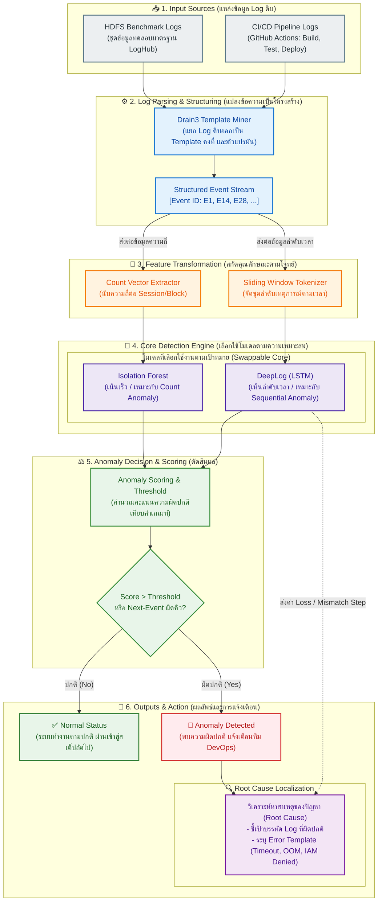

# 01. ผังสถาปัตยกรรมลำดับการทำงานของระบบ (End-to-End System Workflow)

> [!NOTE] นำทางด่วน (Navigation)
> 🏠 **กลับหน้าสารบัญหลัก:** [[SYSTEM_ARCHITECTURE]] | ➡️ **หัวข้อถัดไป:** [[02_lego_modular_architecture]]

---

## 📌 บทนำและภาพรวม

ผังสถาปัตยกรรมนี้แสดงการไหลของข้อมูลตั้งแต่ข้อมูลดิบด้านล่าง (**Layer 0: Input Sources**) ผ่านชั้นการประมวลผลและการเลือกใช้โมเดลที่เหมาะสมที่สุดตามโจทย์ (**Layer 1 - 4**) จนกระทั่งถึงผลลัพธ์การตรวจจับและชี้เป้าปัญหาด้านบน (**Layer 5: Outputs & Root Cause Localization**):

---

## 🔍 รายละเอียดของแต่ละเลเยอร์ (Layer Breakdown)

### Layer 0: แหล่งข้อมูล Log ดิบ (Input Sources)
- **HDFS Benchmark Logs:** ชุดข้อมูลทดสอบมาตรฐานระดับสากลจาก LogHub มีโครงสร้าง Block ID ชัดเจน เหมาะสำหรับการพัฒนา Baseline และการสอบทานความถูกต้องของโค้ด
- **CI/CD Pipeline Logs:** ข้อความ Log จริงจากการรัน CI/CD เช่น GitHub Actions (Build, Test, Deploy) ซึ่งมีทั้ง Log ปกติ และ Log ที่เกิดความผิดพลาด เช่น Network Timeout, Out-Of-Memory (OOM), หรือสิทธิ์ IAM ถูกปฏิเสธ

### Layer 1: การแปลง Log ดิบเป็นโครงสร้าง (Parsing & Structuring)
- **Drain3 Template Miner:** ใช้อัลกอริทึม Fixed-Depth Parse Tree เพื่อตัดตัวแปรผัน (IP, Block ID, Hex, Timestamp) ออก เหลือเพียง Template โครงสร้างข้อความคงที่
- **Structured Event Stream:** กำหนด Event ID เฉพาะตัว (เช่น $E1, E2, E3, \dots$) ทำให้ข้อความภาษามนุษย์ถูกแปลงเป็นรหัสตัวเลขเชิงโครงสร้าง

### Layer 2: การสกัดคุณลักษณะ (Feature Transformation)
- **Count Vector:** นับความถี่ของแต่ละ Event ID ที่เกิดขึ้นใน 1 Session / Block ID (เหมาะกับสถิติจำนวนครั้ง)
- **Sliding Window:** ตัดหน้าต่างลำดับเหตุการณ์ตามแกนเวลาด้วยขนาดคงที่ (เช่น $w=3$) เพื่อนำไปพยากรณ์เหตุการณ์ถัดไป ($X \to y$)

### Layer 3: แกนโมเดลตรวจจับแบบถอดเปลี่ยนได้ (Modular Core Detection Engine)
- **Isolation Forest:** โมเดล Unsupervised Tree สำหรับการตัดแยกจุดผิดปกติจาก Count Vector อย่างรวดเร็ว
- **DeepLog (LSTM):** นิวรอลเน็ตเวิร์ก 2 เลเยอร์ที่เรียนรู้ลำดับขั้นตอนการทำงานปกติ หากมี Event ผิดลำดับจะตรวจจับได้ทันที (Sequential Anomaly Predictor)

### Layer 4: การคำนวณคะแนนและตัดสินผล (Decision & Scoring)
- ประเมินคะแนน Anomaly Score หรือตรวจสอบว่า Target Event อยู่ในกลุ่ม Top-$K$ Candidates หรือไม่
- เปรียบเทียบกับค่า Threshold ที่กำหนดไว้เพื่อสรุปผลว่า ปกติ (Normal) หรือ ผิดปกติ (Anomaly)

### Layer 5: ผลลัพธ์และการชี้เป้าสาเหตุ (Outputs & Explainability)
- **Normal:** ปล่อยผ่านให้กระบวนการใน Pipeline ทำงานต่อ
- **Anomaly Alert:** ส่งสัญญาณแจ้งเตือนทีม DevOps
- **Root Cause Localization:** ดึงบรรทัด Log ต้นตอและถอดรหัส Template ที่เป็น Error ชี้เป้าให้ผู้พัฒนาแก้ไขได้ตรงจุดทันที

---

> [!TIP] หัวข้อถัดไป
> ไปทำความเข้าใจโครงสร้างการออกแบบแบบตัวต่อเลโก้และ Interface มาตรฐานได้ที่:
> ➡️ [[02_lego_modular_architecture]]
