# 02. สถาปัตยกรรมแบบตัวต่อเลโก้และข้อต่อมาตรฐาน (Lego Modular Architecture & Standard Interfaces)

> [!NOTE] นำทางด่วน (Navigation)
> ⬅️ **หัวข้อก่อนหน้า:** [[01_end_to_end_workflow]] | 🏠 **กลับหน้าสารบัญหลัก:** [[SYSTEM_ARCHITECTURE]] | ➡️ **หัวข้อถัดไป:** [[03_count_vector_transformation]]

---

## 🧱 แนวคิดสถาปัตยกรรมแบบตัวต่อเลโก้ (Lego Modularity)

เพื่อให้การพัฒนาระบบสามารถทำแยกชิ้นส่วนกันได้อย่างอิสระ ไม่ผูกมัด (Loosely Coupled) และสามารถสลับเปลี่ยนอัลกอริทึมได้ตลอดเวลา แต่ละบล็อกจะมี **Standard Interface (ข้อต่อมาตรฐาน)** กำกับไว้:

```mermaid
flowchart LR
    classDef b1 fill:#e3f2fd,stroke:#1565c0,stroke-width:2px;
    classDef b2 fill:#fff3e0,stroke:#e65100,stroke-width:2px;
    classDef b3 fill:#e8f5e9,stroke:#2e7d32,stroke-width:2px;
    classDef b4 fill:#fce4ec,stroke:#c2185b,stroke-width:2px;
    classDef b5 fill:#f3e5f5,stroke:#7b1fa2,stroke-width:2px;

    subgraph Brick1["🧱 Block 1: Ingestion"]
        L1["HDFSLoader"]
        L2["GitHubActionsLoader"]
        L3["MockLogGenerator"]
    end
    class Brick1 b1;

    subgraph Brick2["🧱 Block 2: Parser"]
        P1["Drain3Parser"]
        P2["RegexParser"]
    end
    class Brick2 b2;

    subgraph Brick3["🧱 Block 3: Feature Extractor"]
        F1["CountVectorBuilder"]
        F2["SequenceTokenizer"]
    end
    class Brick3 b3;

    subgraph Brick4["🧱 Block 4: Anomaly Model"]
        M1["IsolationForestModel"]
        M2["DeepLogLSTMModel"]
        M3["HybridLogDetector<br/>(Cascaded Synergy)"]
        M1 --> M3
        M2 --> M3
    end
    class Brick4 b4;

    subgraph Brick5["🧱 Block 5: Explainer & Alert"]
        E1["DeepLogExplainer<br/>(Root Cause Locator)"]
        E2["IncidentReporter<br/>(Markdown & JSON)"]
    end
    class Brick5 b5;

    Brick1 == "Iterator[RawLog]" ==> Brick2
    Brick2 == "List[ParsedEvent]" ==> Brick3
    Brick3 == "Feature Tensors / Vectors" ==> Brick4
    Brick4 == "AnomalyResult" ==> Brick5
```

---

## 🔌 สรุปข้อต่อมาตรฐาน (Standard Interfaces สำหรับนักพัฒนา)

| เลโก้บล็อก | ชื่อ Interface หลัก | Method ที่ต้องมี | Output ที่ส่งต่อให้บล็อกถัดไป | โค้ดต้นแบบในโปรเจกต์ |
| :--- | :--- | :--- | :--- | :--- |
| **Block 1: Ingestion** | `BaseLogLoader` | `load() -> Iterator[str]` | ข้อความ Log ดิบทีละบรรทัด (`str`) | `src/ingestion/base.py` |
| **Block 2: Parser** | `BaseLogParser` | `parse(line: str) -> Event` | รหัส Event ID, Block ID, Template | `src/parsers/base.py` |
| **Block 3: Feature** | `BaseFeatureExtractor` | `fit_transform(events) -> Matrix` | Matrix ตัวเลข / Tensor ลำดับเวลา | `src/features/` |
| **Block 4: Model** | `BaseAnomalyModel` | `fit(X)`, `predict(X) -> Result` | ป้ายกำกับ Anomaly และ Anomaly Score | `src/models/` |
| **Block 5: Explainer** | `BaseExplainer` | `explain(Result) -> Report` | บรรทัด Log ต้นเหตุ และรายงานชันสูตร | `src/explainers/` |

---

## 💡 ประโยชน์และตัวอย่างการใช้งานจริง

> [!TIP] ทำไมการออกแบบด้วยสถาปัตยกรรมนี้จึงทรงพลัง?
> 1. **เริ่มง่าย (Phase 1 Baseline):** เริ่มต้นประกอบ `HDFSLoader` + `Drain3Parser` + `CountVectorBuilder` + `IsolationForestModel` เข้าด้วยกันเพื่อทำ Baseline และส่งมอบชิ้นงานแรกได้ทันที
> 2. **ยกระดับง่าย (Phase 2 CI/CD):** เมื่อต้องการตรวจจับความผิดปกติเชิงลำดับ (Sequential Anomaly) ก็เพียงแค่เปลี่ยนเลโก้ `Feature` เป็น `SequenceExtractor` และเปลี่ยน `Model` เป็น `DeepLogLSTMModel` โดยที่ `Ingestion` และ `Parser` ยังคงใช้ตัวเดิม 100%
> 3. **ผสานพลังคู่หู (Phase 3 Hybrid Dual-Engine):** ผสาน `IsolationForestModel` (ด่านตรวจความถี่) และ `DeepLogLSTMModel` (ด่านตรวจลำดับ) ด้วย `HybridLogDetector` ภายใต้กลยุทธ์ **Cascaded Synergy** ตัด False Alarm ลวงทิ้งได้ถึง 46.9% และผลักดันค่า F1-Score แตะ 84.72% โดยรักษา Recall 100% อย่างมั่นคง
> 4. **ทดลองสิ่งใหม่ได้อิสระ:** หากต้องการทดสอบโมเดลทางเลือก (เช่น Transformer-based LogBERT หรือ Autoencoder) ก็สร้าง Class โมเดลใหม่ตาม `BaseAnomalyModel` มาเสียบแทนที่ใน Block 4 ได้เลยโดยไม่ต้องแตะต้องส่วนอื่น

---

> [!TIP] หัวข้อถัดไป
> ดูตัวอย่างการแปลงข้อมูลจริงจากข้อความดิบสู่ตารางตัวเลข Feature Matrix:
> ➡️ [[03_count_vector_transformation]]
