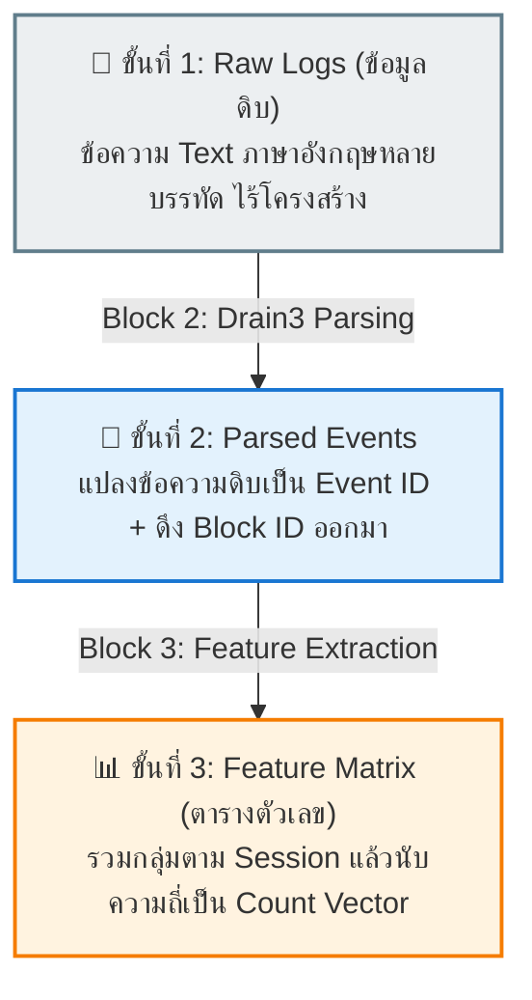

# 03. การแปลงข้อมูลดิบสู่ Feature Matrix (Count Vector สำหรับ Isolation Forest)

> [!NOTE] นำทางด่วน (Navigation)
> ⬅️ **หัวข้อก่อนหน้า:** [[02_lego_modular_architecture]] | 🏠 **กลับหน้าสารบัญหลัก:** [[SYSTEM_ARCHITECTURE]] | ➡️ **หัวข้อถัดไป:** [[04_sequential_sliding_window]]

---

## 📊 ภาพรวมกระบวนการแปลงข้อมูล (Data Transformation)

ส่วนนี้แสดงการเปลี่ยนแปลงรูปทรงของข้อมูลในแต่ละขั้นตอน เพื่อให้เห็นภาพชัดเจนว่าข้อมูลดิบหน้าตาแบบไหน และถูกสกัดออกมาเป็นตารางตัวเลขสำหรับ AI ได้อย่างไร:



---

## ขั้นที่ 1: ข้อมูลดิบที่เข้ามาจริง (Raw Logs Input จาก Block 1)

ข้อมูลจริงที่อ่านมาจากไฟล์ `data/raw/hdfs_sample.log` จะเป็นแค่ข้อความยาวๆ เรียงต่อกัน:

```text
# --- กลุ่มที่ 1: กิจกรรมของบล็อก blk_-1608999687919862906 (ปกติ) ---
081109 203615 148 INFO dfs.DataNode$DataXceiver: Receiving block blk_-1608999687919862906 src: /10.250.19.102:54106 dest: /10.250.19.102:50010
081109 203620 23 INFO dfs.FSNamesystem: BLOCK* NameSystem.allocateBlock: /mnt/hadoop/mapred/system/job.jar. blk_-1608999687919862906
081109 203622 148 INFO dfs.DataNode$PacketResponder: PacketResponder blk_-1608999687919862906 1 received
081109 203624 148 INFO dfs.DataNode$PacketResponder: PacketResponder blk_-1608999687919862906 2 terminating
081109 203625 13 INFO dfs.FSNamesystem: BLOCK* NameSystem.addStoredBlock: blockMap updated: 10.250.19.102:50010 is added to blk_-1608999687919862906 size 91178
081109 203630 148 INFO dfs.DataNode$DataXceiver: 10.250.19.102:50010 Served block blk_-1608999687919862906 to /10.250.19.102:54106

# --- กลุ่มที่ 2: กิจกรรมของบล็อก blk_999999999999999999 (ผิดปกติ / มี Error) ---
081109 204000 160 INFO dfs.DataNode$DataXceiver: Receiving block blk_999999999999999999 src: /10.250.19.102:54106 dest: /10.250.19.102:50010
081109 204001 160 ERROR dfs.DataNode$DataXceiver: Unexpected error trying to delete block blk_999999999999999999. BlockInfo not found in volumeMap.
081109 204002 160 WARN dfs.DataNode$DataXceiver: Verification failed for blk_999999999999999999 checksum mismatch
```

> **ปัญหาของข้อมูลดิบ:** มีความยาวไม่เท่ากัน, ตัวเลข IP และ Timestamp เปลี่ยนตลอดเวลา โมเดล AI ทางคณิตศาสตร์ไม่สามารถนำไปคำนวณตรงๆ ได้

---

## ขั้นที่ 2: ผลลัพธ์หลังผ่าน Block 2 (Parsed Events)

Drain3 จะสกัดเอาตัวแปรออก แล้วแทนที่ด้วยแม่แบบคงที่ (Template) พร้อมแจก **Event ID (E1, E2, ...)**:

- `E1` = `Receiving block <*> src: <*> dest: <*>`
- `E2` = `BLOCK* NameSystem.allocateBlock: <*> <*>`
- `E3` = `PacketResponder <*> <*> terminating / received`
- `E4` = `BLOCK* NameSystem.addStoredBlock: blockMap updated: <*> is added to <*> size <*>`
- `E5` = `<*> Served block <*> to <*>`
- `E6` = `ERROR Unexpected error trying to delete block <*>` *(เหตุการณ์ Error)*
- `E7` = `WARN Verification failed for <*> checksum mismatch` *(เหตุการณ์ Warning)*

---

## ขั้นที่ 3: ผลลัพธ์หลังผ่าน Block 3 (Feature Matrix / Count Vector)

Block 3 จะนำ Log ที่มี **Block ID เดียวกัน** มารวมกลุ่มเป็น 1 แถว (1 Session) แล้วนับว่าแต่ละ Event เกิดขึ้นกี่ครั้ง:

| Block ID (Session Key) | E1 (Receive) | E2 (Allocate) | E3 (Responder) | E4 (AddStored) | E5 (Served) | E6 (DeleteErr) | E7 (ChecksumErr) | สถานะจริง (Ground Truth) |
| :--- | :---: | :---: | :---: | :---: | :---: | :---: | :---: | :---: |
| `blk_-1608999...` | **1** | **1** | **2** | **1** | **1** | **0** | **0** | ✅ **Normal** |
| `blk_7503483...` | **1** | **0** | **2** | **1** | **1** | **0** | **0** | ✅ **Normal** |
| `blk_3587508...` | **1** | **0** | **2** | **1** | **0** | **0** | **0** | ✅ **Normal** |
| `blk_9999999...` | **1** | **0** | **0** | **0** | **0** | **1** | **1** | 🚨 **Anomaly** |

---

## 💡 จุดที่ทำให้โมเดล AI (Isolation Forest) รู้ว่าแถวไหนผิดปกติ

1. **กลุ่มปกติ (Normal Rows):** ตัวเลขในคอลัมน์ `E1` ถึง `E5` จะมีค่าปกติสม่ำเสมอ และในคอลัมน์ `E6` กับ `E7` จะเป็น **0 ทั้งหมด**
2. **กลุ่มผิดปกติ (Anomaly Row):** ในแถวของ `blk_9999999...` ตัวเลขในเหตุการณ์ปกติแทบไม่มี แต่กลับมีตัวเลขโผล่ขึ้นมาในคอลัมน์ **`E6` = 1** และ **`E7` = 1**
3. **เมื่อส่งตารางนี้ให้ AI:** โมเดลจะตรวจจับเวกเตอร์ `[1, 0, 0, 0, 0, 1, 1]` ว่าเป็นจุดข้อมูลที่อยู่ห่างไกลจากเพื่อนๆ (Outlier) และสามารถแยกโดดเดี่ยว (Isolate) ได้อย่างรวดเร็วที่ Tree Depth ต่ำๆ ตามหลักการของ *Liu et al., 2008* และชี้เป้าว่าเป็น **Anomaly ทันที!**

---

> [!TIP] ข้อจำกัดของการนับความถี่ และทางแก้
> การนับความถี่ (Count Vector) เหมาะกับกรณีที่ Error ปรากฏตัวออกมาตรงๆ แต่ **ไม่สามารถตรวจจับเหตุการณ์ที่สลับลำดับหรือข้ามขั้นตอนได้**
> หากต้องการตรวจจับความผิดปกติเชิงลำดับเวลา ต้องไปดูในหัวข้อ:
> ➡️ [[04_sequential_sliding_window]]
