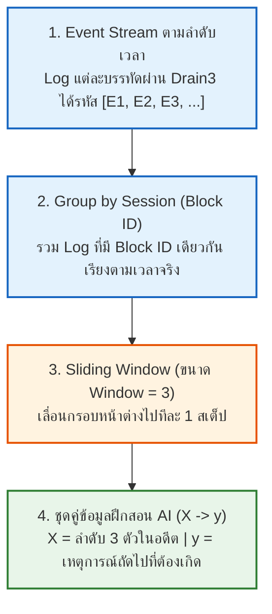

# 04. การสกัด Feature ลำดับเวลา (Sliding Window สำหรับ DeepLog / LSTM)

> [!NOTE] นำทางด่วน (Navigation)
> ⬅️ **หัวข้อก่อนหน้า:** [[03_count_vector_transformation]] | 🏠 **กลับหน้าสารบัญหลัก:** [[SYSTEM_ARCHITECTURE]] | ➡️ **หัวข้อถัดไป:** [[05_lstm_execution_flow]]

---

## ⏱️ ทำไมต้องสกัด Feature ลำดับเวลา (Sequential Features)?

สำหรับ **Phase 2 (Sequential Anomaly)** เราไม่สามารถใช้การนับความถี่ (Count Vector) ได้ เพราะการนับความถี่ไม่สนใจลำดับก่อน-หลัง (Order-agnostic) โมดูล `SequenceExtractor` จึงถูกพัฒนาขึ้นมาเพื่อแปลง Log ให้กลายเป็น **"คู่ลำดับเวลา (Input X $\rightarrow$ Target y)"** โดยมีขั้นตอนดังนี้:



---

## 🪟 เจาะลึกการเลื่อนหน้าต่าง (Sliding Window Mechanism)

สมมติบล็อก `blk_-1608999...` มีประวัติการทำงานเรียงตามเวลาจริงคือ:
$$\text{Sequence} = [E1, E2, E3, E3, E4, E5]$$

เมื่อกำหนดขนาดหน้าต่าง **`window_size = 3`** หน้าต่างจะเลื่อนไปทีละก้าวเพื่อสร้างคู่ข้อมูลสอน AI ดังนี้:

```text
[ ก้าวที่ 1 ]:  [ E1 , E2 , E3 ]  ──ทายตัวถัดไป──>  E3
                 └─────┬─────┘                       │
                    Input (X)                    Target (y)

[ ก้าวที่ 2 ]:       [ E2 , E3 , E3 ]  ──ทายตัวถัดไป──>  E4
                      └─────┬─────┘                       │
                         Input (X)                    Target (y)

[ ก้าวที่ 3 ]:            [ E3 , E3 , E4 ]  ──ทายตัวถัดไป──>  E5
                            └─────┬─────┘                       │
                               Input (X)                    Target (y)
```

---

## 📋 โครงสร้างข้อมูลจริงหลังผ่าน `SequenceExtractor`

ตารางสรุปคู่ข้อมูล `(X, y)` ที่ถูกแปลงเป็น Numpy Array และ Tensor พร้อมส่งเข้าสู่ **LSTM Neural Network**:

| ที่มา (Session / Block ID) | หน้าต่างในอดีต: Input ($X$) | คำตอบที่ต้องทาย: Target ($y$) | ความหมายเชิงบริบทของระบบ |
| :--- | :---: | :---: | :--- |
| `blk_-1608999...` (ก้าว 1) | `[ 1 , 2 , 3 ]` | **`3`** | *"หลัง Receive (1) และ Allocate (2) ตัว Responder (3) ต้องเริ่มทำงาน"* |
| `blk_-1608999...` (ก้าว 2) | `[ 2 , 3 , 3 ]` | **`4`** | *"หลัง Responder ทำงานเสร็จ (3) สเต็ป AddStoredBlock (4) ต้องตามมา"* |
| `blk_-1608999...` (ก้าว 3) | `[ 3 , 3 , 4 ]` | **`5`** | *"หลังบันทึก Block สำเร็จ (4) ต้องเกิดสเต็ป Served Block (5)"* |
| `blk_7503483...` (ก้าว 1) | `[ 1 , 3 , 3 ]` | **`4`** | รูปแบบปกติอีกเส้นทางหนึ่ง |
| `blk_7503483...` (ก้าว 2) | `[ 3 , 3 , 4 ]` | **`5`** | สอดคล้องกับพฤติกรรมปกติ |

---

## 🚨 จุดที่ Neural Network (DeepLog) จะสั่งเตือน Anomaly

เมื่อนำโมเดลที่เรียนรู้ลำดับปกตินี้ไปตรวจจับ Log ใหม่:
1. หากระบบส่งประวัติเข้ามาว่า: `Input = [1, 2, 3]`
2. โมเดล LSTM จะทำนายว่า Event ถัดไปควรเป็น **Top-Candidates: `[3, 4]`**
3. **แต่ถ้าในระบบจริง Event ถัดไปกลับกลายเป็น `E6 (Error)` หรือ `E5 (ข้ามสเต็ปกระโดดข้ามการบันทึก Block)`**

$$\text{Next Event } (E6) \notin \text{Top-Candidates } [3, 4] \implies \mathbf{🚨 \text{Sequential Anomaly!}}$$

---

> [!TIP] หัวข้อถัดไป
> ดูการไหลของข้อมูลภายในเซลล์ประสาท LSTM และโค้ด `forward()` ได้ที่:
> ➡️ [[05_lstm_execution_flow]]
