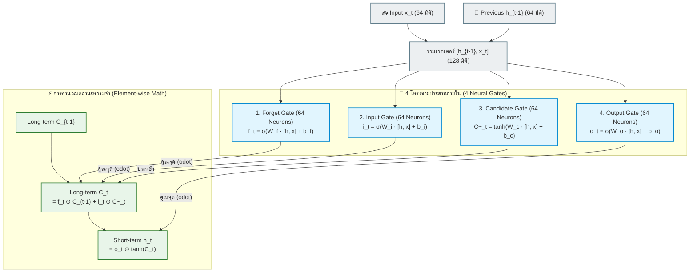
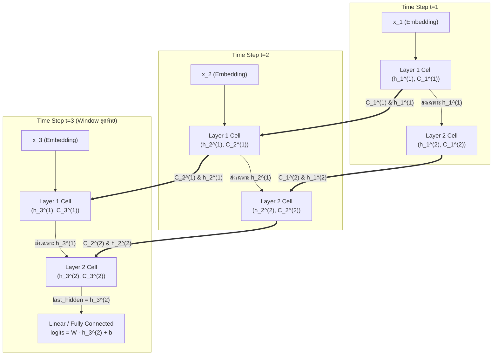
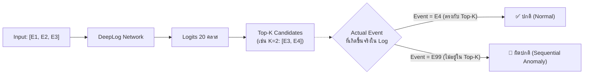

# 06. การทำงานของ Neural Network ภายใน LSTM Model (DeepLog Network Internals)

> [!NOTE] นำทางด่วน (Navigation)
> ⬅️ **หัวข้อก่อนหน้า:** [[05_lstm_execution_flow]] | 🏠 **กลับหน้าสารบัญหลัก:** [[SYSTEM_ARCHITECTURE]]

เอกสารฉบับนี้อธิบาย **โครงสร้างทางประสาทวิทยาศาสตร์คอมพิวเตอร์และคณิตศาสตร์ (Neural Network Internals)** ของคลาส `DeepLogNetwork` ในโปรเจกต์ของเรา (`src/models/deeplog_lstm.py`) เพื่อให้เห็นภาพชัดเจนว่าภายในเซลล์ประสาทเทียมของ LSTM มีการเชื่อมต่ออย่างไร, คำว่า "Neuron" อยู่ตรงไหน, และเลเยอร์ 1 กับเลเยอร์ 2 ส่งต่อข้อมูลกันอย่างไรในทางกายภาพ

---

## 🧠 1. เซลล์ประสาท (Neuron) ใน LSTM อยู่ตรงไหนกันแน่?

ความเข้าใจผิดที่พบบ่อยคือคิดว่า *"1 LSTM Cell = 1 Neuron"* แต่ในความเป็นจริง:

> [!IMPORTANT] ความจริงของหน่วยประสาทใน LSTM
> ในโมเดลของเราที่กำหนด **`hidden_dim = 64`** หมายความว่าใน 1 เลเยอร์ของ LSTM จะมี **Hidden Units (Neurons) ทำงานขนานกัน 64 ตัว** 
> และเนื่องจากภายใน LSTM มีถึง 4 ประตู (Gates) แต่ละประตูจะมีโครงข่ายประสาทเทียม (Dense Layer) ขนาด 64 นิวรอนเป็นของตัวเอง
> **ดังนั้น ใน 1 เลเยอร์ จะมีนิวรอนทำงานร่วมกันถึง $64 \times 4 = 256$ นิวรอน!**



---

## 📐 2. สูตรคณิตศาสตร์ของ 4 ประตู (Gates Equation)

ในทุกๆ Time Step $t$ ข้อมูลจะถูกคำนวณผ่าน 4 สมการหลัก:

### 1. Forget Gate ($f_t \in (0, 1)^{64}$)
ทำหน้าที่ตัดสินใจว่า **"ข้อมูลความจำระยะยาวเดิม ($C_{t-1}$) ส่วนไหนควรโยนทิ้งไป"**
$$f_t = \sigma(W_f \cdot [h_{t-1}, x_t] + b_f)$$
- หากผลลัพธ์ใกล้ $0$: ลืมข้อมูลนั้นทิ้งไป
- หากผลลัพธ์ใกล้ $1$: เก็บรักษาข้อมูลเดิมไว้ครบถ้วน

### 2. Input Gate ($i_t \in (0, 1)^{64}$) & Candidate Cell ($\tilde{C}_t \in (-1, 1)^{64}$)
ทำหน้าที่คัดกรองว่า **"ข้อมูลใหม่ที่เพิ่งเข้ามา มีค่าควรแก่การจดจำลง Memory ระยะยาวแค่ไหน"**
$$i_t = \sigma(W_i \cdot [h_{t-1}, x_t] + b_i)$$
$$\tilde{C}_t = \tanh(W_c \cdot [h_{t-1}, x_t] + b_c)$$

### 3. Cell State Update ($C_t \in \mathbb{R}^{64}$) — รางรถไฟสายตรง (Constant Error Carousel)
แกนหลักของ LSTM ที่รักษา Gradient ไม่ให้หายไปตามกาลเวลา:
$$C_t = \underbrace{f_t \odot C_{t-1}}_{\text{ของเดิมที่เหลือรอด}} + \underbrace{i_t \odot \tilde{C}_t}_{\text{ของใหม่ที่ถูกบันทึกเพิ่ม}}$$
*(สัญลักษณ์ $\odot$ คือ Element-wise Multiplication หรือการคูณสมาชิกตำแหน่งต่อตำแหน่ง)*

### 4. Output Gate ($o_t \in (0, 1)^{64}$) & Hidden State ($h_t \in (-1, 1)^{64}$)
เลือกว่าจะดึงส่วนใดของความจำระยะยาว $C_t$ ออกมาเผยแพร่สู่ภายนอกเป็น **Short-term Memory ($h_t$)**:
$$o_t = \sigma(W_o \cdot [h_{t-1}, x_t] + b_o)$$
$$h_t = o_t \odot \tanh(C_t)$$

---

## 🏢 3. การเชื่อมต่อ 2 เลเยอร์ (Multi-Layer Stacking: Layer 1 $\to$ Layer 2)

ในโค้ด `src/models/deeplog_lstm.py` เรากำหนด `num_layers = 2` การทำงานทางกายภาพเป็นดังนี้:



### ❓ ทำไม Layer 1 ส่งแค่ $h_t^{(1)}$ ให้ Layer 2 โดยไม่ส่ง $C_t^{(1)}$ ข้ามเลเยอร์?

1. **บทบาทของ $C_t$ (Cell State):** 
   $C_t$ คือ **เส้นทางส่งสัญญาณแบบเส้นตรง (Linear Highway / Constant Error Carousel)** ภายในเลเยอร์นั้นๆ ไม่มี Activation บีบอัด เพื่อให้ Gradient ย้อนกลับข้ามเวลาได้สะดวก การส่งข้ามเลเยอร์จะทำลายคุณสมบัตินี้
2. **บทบาทของ $h_t$ (Hidden State):**
   $h_t = o_t \odot \tanh(C_t)$ คือข้อมูลที่ผ่าน **Non-linear Activation ($\tanh$)** และถูกคัดกรองผ่าน Output Gate เรียบร้อยแล้ว จึงมีสถานะเป็น **Feature Representation** ที่พร้อมทำหน้าที่เป็น "Input เสมือน" ให้แก่เลเยอร์ถัดไปในแนวตั้ง

---

## 📦 4. การแปลงมิติของ Tensor ในโค้ดจริง (Tensor Shapes Tracing)

ลองแกะรอยมิติของข้อมูลทีละบรรทัดใน `DeepLogNetwork`:

```python
# สมมติ batch_size = 16, window_size = 3, embedding_dim = 64, hidden_dim = 64, vocab_size = 20
```

| บรรทัดโค้ด | คำสั่งใน PyTorch | Tensor Shape ที่ได้ | ความหมายทางประสาทเทียม |
| :--- | :--- | :---: | :--- |
| **Input** | `x` | `[16, 3]` | Event ID 3 ตัว จำนวน 16 Sessions |
| **Line 28** | `embedded = self.embedding(x)` | `[16, 3, 64]` | แต่ละ Event ID ถูกแปลงเป็นเวกเตอร์ 64 มิติ |
| **Line 29** | `lstm_out, (h_n, c_n) = self.lstm(embedded)` | `[16, 3, 64]` | เวกเตอร์ Short-term ($h$) ของ **Layer 2** ทั้ง 3 Time Steps |
| **Line 30** | `last_hidden = lstm_out[:, -1, :]` | `[16, 64]` | หยิบเฉพาะ $h_3^{(2)}$ (เวกเตอร์สรุปเหตุการณ์ทั้งหมด ณ สเต็ป 3) |
| **Line 31** | `logits = self.fc(last_hidden)` | `[16, 20]` | แปลงเวกเตอร์ 64 มิติ เป็นคะแนนความน่าจะเป็นของ 20 Events |

---

## 🎯 5. กลไกการตรวจจับความผิดปกติ (Inference & Anomaly Decision)

เมื่อนำโมเดลไปใช้งานจริง (`predict_session`):



1. **คำนวณ Logits:** โมเดลประเมินความน่าจะเป็นของเหตุการณ์ที่จะเกิดขึ้นต่อไปจากบริบทในอดีต
2. **คัดกรอง Top-$K$:** หยิบเอา Event ที่มีคะแนนสูงสุด $K$ อันดับแรก (เช่น $K=2$) มาเป็นกลุ่ม "เหตุการณ์ที่ยอมรับได้"
3. **ตรวจสอบความสอดคล้อง:** หาก Log จริงที่เกิดขึ้นเป็นเหตุการณ์ที่ไม่ได้อยู่ในกลุ่ม Top-$K$ นี้ ระบบจะตัดสินทันทีว่าเกิด **Sequential Anomaly** (เช่น มีขั้นตอนข้าม, เกิด Timeout, หรือมี Error เกิดแทรกกลางคัน)
