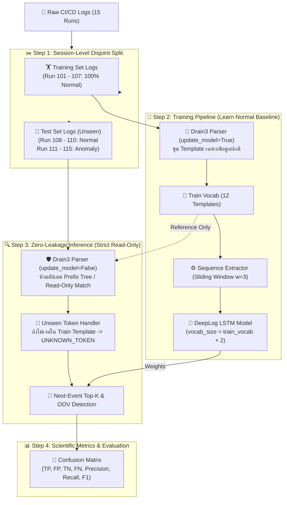

# 🔬 ระเบียบวิธีทดสอบและการป้องกัน Data Leakage (Evaluation Methodology & Zero-Leakage Audit)

> [!IMPORTANT] วัตถุประสงค์ของเอกสาร
> เอกสารฉบับนี้อธิบายกระบวนการทดสอบ (Evaluation Pipeline), การแบ่งชุดข้อมูล (Data Splitting Strategy), การวิเคราะห์จุดเสี่ยงการรั่วไหลของข้อมูล (**Data Leakage Audit**), และสูตรการคำนวณทางสถิติที่ใช้ในการประเมินประสิทธิภาพโมเดล DeepLog LSTM เพื่อให้ผลการทดลองทางวิทยาศาสตร์มีความน่าเชื่อถือ โปร่งใส และนำไปใช้งานจริงบน Production ได้อย่างมั่นใจ

---

## 🧭 แผนผังกระบวนการทดสอบแบบ Zero-Leakage (Strict Inductive Pipeline)

---

## 1. ยุทธศาสตร์การแบ่งชุดข้อมูล (Data Splitting Strategy)

### 1.1 ทำไมต้องแบ่งที่ระดับ Session (Session-Level Disjoint Split)?
ในงานประมวลผล Log สำหรับตรวจจับสิ่งผิดปกติ ความผิดพลาดร้ายแรงที่สุดที่มักพบในงานวิจัยเริ่มต้นคือ:
- **Random Line Splitting:** การสุ่มบรรทัด Log ข้ามกันระหว่าง Train และ Test
- **Post-Window Random Splitting:** การแปลง Sliding Window ทั้งก้อน แล้วใช้ `train_test_split(X, y)`

> [!CAUTION] Sliding Window Leakage คืออะไร?
> หากเราสร้าง Sliding Window ขนาด $w=3$ จาก Log เดียวกัน:
> - Window ที่ 1: $[e_1, e_2, e_3] \to e_4$
> - Window ที่ 2: $[e_2, e_3, e_4] \to e_5$
> 
> หาก Window ที่ 1 ไปตกอยู่ใน **Train Set** และ Window ที่ 2 ไปตกอยู่ใน **Test Set** ตัวโมเดลจะมีข้อมูลที่ "แอบดูข้อสอบร่วมกัน" ถึง 75% ($e_2, e_3, e_4$) ทำให้ค่าความแม่นยำสูงเกินจริงแบบปลอมๆ (Data Contamination)

**วิธีแก้ปัญหาในระบบนี้:**
เราใช้เทคนิค **Session-Level Disjoint Splitting**:
- แบ่งตาม `Run ID` ของ CI/CD Pipeline โดยสิ้นเชิง
- `Run_101` ถึง `Run_107` อยู่ใน Training Set เท่านั้น
- `Run_108` ถึง `Run_115` อยู่ใน Test Set เท่านั้น
- **ไม่มี Sliding Window ใดๆ คาบเกี่ยวข้าม Session เด็ดขาด (Zero Overlap)**

---

### 1.2 ข้อสมมติฐานชุดข้อมูลสอน (One-Class / Semi-Supervised Assumption)
ตามทฤษฎีเปเปอร์สากลของ DeepLog (*Du et al., ACM CCS 2017*):
1. **Training Set (Normal Only):** จะต้องประกอบด้วยรอบการทำงานที่ **ปกติ 100% (Contamination Rate = 0%)** เท่านั้น เพื่อให้โครงข่ายประสาทเทียมเรียนรู้ "วิถีชีวิตปกติที่ควรจะเป็น"
2. **Test Set (Unseen Mixture):** ประกอบด้วย:
   - **Unseen Normal Runs (30%):** เพื่อทดสอบว่าโมเดลไม่เกิด False Alarm (ทายถูกว่าเป็นปกติ)
   - **Anomaly Runs (100%):** เพื่อทดสอบว่าโมเดลสามารถตรวจจับทั้ง Event แปลกปลอม และ ลำดับขั้นตอนผิดปกติ (Step Skipping, Reordering) ได้ครบถ้วน

---

## 2. การวิเคราะห์จุดเสี่ยง Data Leakage (Forensic Leakage Audit)

| ลำดับจุดตรวจสอบ | สถานะเดิม | ความเสี่ยงที่ตรวจพบ | วิธีแก้ไขแบบ Zero-Leakage (ปัจจุบัน) | สถานะความปลอดภัย |
| :--- | :--- | :--- | :--- | :--- |
| **1. Split Level** | แบ่งตาม Run ID | ไม่มี | ใช้ Session-Level Split ป้องกัน Sliding Window รั่วไหล | 🟢 ปลอดภัย 100% |
| **2. Drain3 Parser** | รัน `parse_line` ก้อนเดียว | **Subtle Leak:** ขุด Template ของ Test ก่อน Train ทำให้ Tree รู้จักคำศัพท์ข้อสอบล่วงหน้า (*Transductive*) | แยกชัดเจน: Train ใช้ `update_model=True`, Test ใช้ `update_model=False` (*Strict Inductive*) | 🟢 ปลอดภัย 100% |
| **3. Vocab Size Allocation** | ใช้ Vocab รวม 20 ตัว | **Architectural Leak:** ขนาด Layer ของโมเดลรู้ล่วงหน้าว่ามีกี่ Template ใน Test | โมเดลจอง Output Dimension ตาม `train_vocab_size + 2` เท่านั้น | 🟢 ปลอดภัย 100% |
| **4. Feature Extractor** | `fit_transform` บน Train | ไม่มี | Extractor เรียนรู้และสร้าง Vocabulary เฉพาะจาก Train Events | 🟢 ปลอดภัย 100% |
| **5. Model Weights & Logic** | เรียนรู้เฉพาะ X, y ของ Train | ไม่มี | โมเดล LSTM และ `normal_vocab` ไม่เคยเห็นลำดับเหตุการณ์ของ Test Set | 🟢 ปลอดภัย 100% |

---

## 3. ระเบียบวิธีคำนวณมาตรวัดประสิทธิภาพ (Evaluation Metrics Formulation)

ระบบใช้ฟังก์ชัน [`calculate_metrics`](file:///home/kora/Project/AI%20Project/src/evaluation/metrics.py#L5-L56) คำนวณค่าทางสถิติมาตรฐานสำหรับ Binary Classification:

$$
\text{Accuracy} = \frac{TP + TN}{TP + FP + TN + FN}
$$

$$
\text{Precision} = \frac{TP}{TP + FP} \quad \text{(ความแม่นยำในการเตือนภัย ไม่ส่ง False Alarm)}
$$

$$
\text{Recall (Sensitivity)} = \frac{TP}{TP + FN} \quad \text{(อัตราการดักจับ Anomaly ไม่หลุดรอด)}
$$

$$
\text{Specificity} = \frac{TN}{TN + FP} \quad \text{(ความสามารถในการปล่อยผ่านเคสปกติ)}
$$

$$
\text{F1-Score} = 2 \times \frac{\text{Precision} \times \text{Recall}}{\text{Precision} + \text{Recall}} \quad \text{(ค่าเฉลี่ยฮาร์มอนิกระหว่าง Precision และ Recall)}
$$

---

## 4. ข้อจำกัดทางสถิติที่ต้องตระหนัก (Statistical Caveats & Next Step)

> [!WARNING] ข้อจำกัดด้านขนาดกลุ่มตัวอย่าง (Sample Size Variance)
> ปัจจุบัน Benchmark ในไฟล์ `cicd_benchmark.log` มีขนาดทดสอบรวม 8 Runs (3 Normal + 5 Anomaly):
> - การได้คะแนน **Precision = 100%, Recall = 100%, F1 = 100%** ถือเป็น **Proof of Concept Verification** ยืนยันว่าอัลกอริทึมและโค้ดทำงานถูกต้องตามหลักการ
> - อย่างไรก็ตาม ในทางสถิติ กลุ่มตัวอย่าง $N=8$ ยังมีค่า Variance สูง เมื่อนำไปใช้งานจริงบนสภาพแวดล้อม CI/CD ที่มี Log นับหมื่นรัน ตัวเลขอาจลดลงตามความซับซ้อนของ Error ข้อความใหม่
> - **ก้าวต่อไป:** ประเมินโมเดลกับ Dataset ขนาดใหญ่ระดับ Production จาก `data/raw/real_gha/` (D2KLab/gha-dataset)
