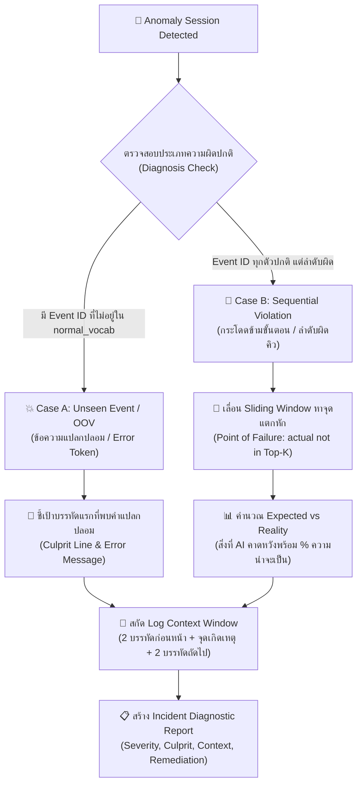

# 🕵️ การชี้เป้าและวิเคราะห์ต้นตอความผิดปกติ (Root Cause Localization & Block 5 Explainer)

> [!NOTE] วัตถุประสงค์ของเอกสาร
> เอกสารฉบับนี้อธิบายกลไกการทำงานของ **Lego Brick 5 (`DeepLogExplainer`)** ซึ่งทำหน้าที่เปลี่ยนผลการทำนายดิบของ AI (`Prediction = 1: Anomaly`) ให้กลายเป็น **พิกัดบรรทัดจริงใน Log, บริบทแวดล้อม และรายงานการชันสูตรเชิงลึก (Incident Diagnostic Report)** ที่วิศวกรสามารถอ่านเข้าใจและนำไปแก้ปัญหาได้ทันที

---

## 🧭 แผนผังกระบวนการชันสูตรปัญหา (Root Cause Diagnostic Flow)



---

## 1. ปัญหาของ Anomaly Detection ที่ไม่มี Explainer

ในระบบตรวจจับความผิดปกติแบบดั้งเดิม โมเดล AI จะพ่นผลลัพธ์ออกมาเพียง:
$$\hat{y} \in \{0, 1\}$$
เมื่อค่า $\hat{y} = 1$ (ผิดปกติ) ในไฟล์ Log ขนาด 45,000 บรรทัด หากไม่มี **Block 5 Explainer** วิศวกรจะต้องเสียเวลานั่งค้นหาด้วยตนเอง ซึ่งทำให้เกิดความล่าช้าในการแก้ไขปัญหา (MTTR: Mean Time to Resolution สูงขึ้น)

**สิ่งที่ `DeepLogExplainer` เข้ามาแก้:**
1. **WHERE:** ระบุ Line Number, Timestamp, และชื่อขั้นตอนใน CI/CD ที่เกิดเหตุ
2. **WHY:** ชี้แจงว่าเกิดจาก Error ใหม่ หรือ ลำดับขั้นตอนข้ามไป
3. **CONTEXT:** ดึง Log ก่อนและหลังเกิดเหตุมาประกบให้เห็นภาพ

---

## 2. กลไกการตรวจจับ 2 ชั้น (Two-Tier Root Cause Diagnosis)

### ชั้นที่ 1: ตรวจจับข้อความแปลกปลอม (Unseen Event / Out-of-Vocabulary)
* **กลไก:** วนลูปตรวจสอบทีละบรรทัดใน Session:
  ```python
  if event["template_id"] not in model.normal_vocab:
      # บรรทัดนี้คือ Culprit Line ทันที!
  ```
* **ตัวอย่างจริง:** 
  - ในไฟล์ `8_Test 3.11 x64 wheels for windows-latest.txt` บรรทัดที่ 75 พบข้อความดาวน์โหลด `651.8 kB/s eta 0:00:00` ซึ่งไม่มีใน Train Set
  - Explainer จะชี้เป้าบรรทัดที่ 75 พร้อมดึงบรรทัดที่ 74 และ 76 มาแสดงเป็นบริบท

---

### ชั้นที่ 2: ตรวจจับการกระโดดข้ามขั้นตอน (Sequential Violation)
* **กลไก:** หาก Event ทุกตัวใน Session เป็นตัวเลขปกติ แต่โมเดลยังตัดสินว่าเป็น Anomaly Explainer จะเลื่อน Sliding Window $w=3$:
  ```python
  logits = model.net(window_tensor)
  probs = F.softmax(logits, dim=-1)
  topk = torch.topk(probs, k=top_k)
  if actual_next not in topk.indices:
      # พบจุดที่ลำดับแตกหัก!
  ```
* **สิ่งที่เปิดเผยออกมา:**
  - **Previous Window:** $[e_{t-2}, e_{t-1}, e_t]$ ลำดับ 3 ตัวก่อนหน้า
  - **Expected Candidates:** ลำดับที่ควรจะเกิดตามที่ AI เรียนรู้มา พร้อมค่า Softmax Probability (เช่น Event 4: 92.5%)
  - **Actual Event:** เหตุการณ์ที่เกิดขึ้นจริง (เช่น Event 5: 0.05%)

---

## 3. ตัวอย่างรายงานการชันสูตรจริง (Incident Report Sample)

```text
================================================================================
🚨 [INCIDENT DIAGNOSTIC REPORT] • Run_Sequential_Skip
================================================================================
• ประเภทความผิดปกติ (Anomaly Type):     Sequential Violation / Step Skipping
• กลไกการตรวจจับ (Detection Mechanism): DeepLog LSTM Sequence Predictor (Top-1)
• ระดับความรุนแรง (Severity):           [CRITICAL]
• พิกัดบรรทัดต้นเหตุ (Culprit Line):     บรรทัดที่ 104
• ข้อความใน Log (Message):              "Deploy directly without test!"
• รหัสแม่พิมพ์ (Template):               Event 5 -> "[Step: Deploy] Deploy to server"
• ข้อมูลทางเทคนิค (Technical Reason):    ลำดับขั้นตอนผิดคิว: หลังจากผ่านลำดับเหตุการณ์ [1, 2, 3] โมเดลคาดหวัง Event [4] แต่พบ Event 5 โผล่ขึ้นมาแทน (ความน่าจะเป็นจากการคำนวณของโมเดล: 0.00%)

📊 ความน่าจะเป็นของลำดับขั้นตอน (Expected vs Actual):
  - [สิ่งที่ควรเกิด] Event 4: "[Step: Test] Run pytest" (P = 100.0%)
  👉 [ที่เกิดขึ้นจริง] Event 5: "[Step: Deploy] Deploy to server" (P = 0.0%)

📄 บริบทแวดล้อมของ Log ณ จุดเกิดเหตุ (Log Context Window):
      [Line  102]: Setup Python
      [Line  103]: Install deps
  👉 [CULPRIT] [Line  104]: Deploy directly without test!
================================================================================
```

