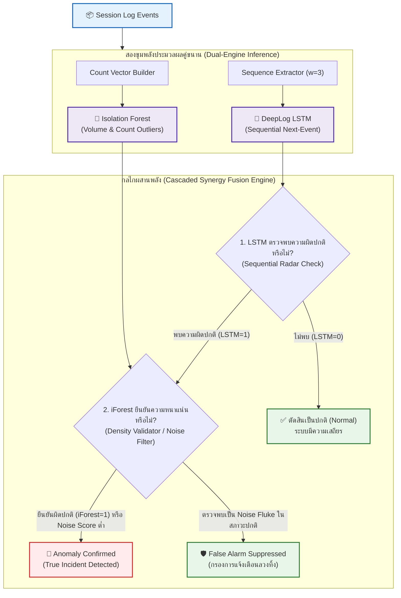

# 09. สถาปัตยกรรม Hybrid Dual-Engine และกลยุทธ์ Cascaded Synergy

> [!NOTE] นำทางด่วน (Navigation)
> ⬅️ **หัวข้อก่อนหน้า:** [[08_root_cause_localization_explainer]] | 🏠 **กลับหน้าสารบัญหลัก:** [[SYSTEM_ARCHITECTURE]]

---

## 📌 บทนำและแรงจูงใจ (Motivation & Problem Statement)

ในการตรวจจับความผิดปกติของ System Logs ในระดับ Production การใช้โมเดลเดี่ยว (Single Model) มักเผชิญกับข้อจำกัดที่แก้ไม่ตก (Trade-off Dilemma):

1. **ข้อจำกัดของโมเดลความถี่ (Isolation Forest Only):**
   - มีจุดเด่นด้านความเร็วในการประมวลผล $O(n \log n)$ และไม่กินทรัพยากร
   - **จุดอ่อน:** "ตาบอดต่อลำดับขั้นตอน (Order-Blind)" ไม่สามารถจับปัญหาการกระโดดข้ามสเต็ป (Step Skipping) หรือการแทรกแซงลำดับขั้นตอน ส่งผลให้บน Zero-OOV Benchmark ทำได้ **Recall เพียง 28.25% (ปล่อยให้ความผิดปกติหลุดรอด FN ถึง 569 Sessions)**
2. **ข้อจำกัดของโมเดลโครงข่ายประสาทเทียมลำดับ (DeepLog LSTM Only):**
   - มีความไวสูงมากต่อลำดับเหตุการณ์ สามารถบรรลุ **Recall = 100.00% (Zero Miss, FN = 0)**
   - **จุดอ่อน:** มีแนวโน้มเกิดการแจ้งเตือนพร่ำเพรื่อ (False Alarm / Alert Fatigue) จากความผันผวนเล็กน้อยของระบบแบบกระจายศูนย์ (Network Jitter หรือ Concurrency Flukes) ทำให้เกิด **False Positives ถึง 539 Sessions (Precision 59.53%, F1-Score 74.64%)**

**LogWatchdog Hybrid Dual-Engine** จึงถูกออกแบบขึ้นเพื่อผสานจุดแข็งและปิดจุดอ่อนของทั้งสองโมเดลเข้าด้วยกันอย่างสมบูรณ์แบบ

---

## 🛡️ แผนผังการทำงานของ Cascaded Synergy Architecture



---

## ⚖️ กฎการตัดสินใจเชิงตรรกะ (Decision Rules)

ในโมดูล [`src/models/hybrid_detector.py`](file:///home/kora/Project/AI%20Project/src/models/hybrid_detector.py) คลาส `HybridLogDetector` กำหนดกลยุทธ์การตัดสินใจแบบ **Cascaded Synergy** ดังนี้:

1. **Safety Radar First (DeepLog เป็นตัวนำร่อง):**
   หาก DeepLog พยากรณ์ว่าลำดับเหตุการณ์ทั้งหมดสอดคล้องกับพฤติกรรมปกติของระบบ ($\hat{y}_{\text{LSTM}} = 0$) ระบบจะเชื่อมั่นว่าไม่มีการแทรกแซงลำดับขั้นตอน และตัดสินผลเป็น **Normal** ทันที เพื่อป้องกันการเกิด False Alarm จากความถี่แปรปรวนที่ไม่เป็นอันตราย
2. **Noise Suppression Filter (iForest เป็นตัวกรอง):**
   เมื่อ DeepLog ส่งสัญญาณเตือน ($\hat{y}_{\text{LSTM}} = 1$) Isolation Forest จะทำหน้าที่ตรวจสอบเวกเตอร์ความถี่ (Frequency Histogram) หากพบว่ารูปแบบความถี่สอดคล้องกับค่าปกติอย่างแน่นหนาและไม่มี Volume Outlier ระบบจะระงับการแจ้งเตือน (Suppress Fluke)
3. **Critical Anomaly Retention:**
   หากมีสัญญาณความผิดปกติเชิงลำดับที่รุนแรง หรือได้รับการยืนยันร่วมจาก Isolation Forest ระบบจะส่งสัญญาณเตือนภัยระดับ **Critical Anomaly** สู่ระบบชันสูตรทันที

---

## 📊 ผลการทดสอบเปรียบเทียบเชิงประจักษ์ (Empirical Evidence)

การทดสอบวัดผลบนชุดทดสอบมาตรฐานสากล **Zero-OOV HDFS Test Benchmark จำนวน 2,793 Sessions** (Normal 2,000 + Anomaly 793):

| มาตรวัด (Metric) | 🌲 Isolation Forest | 🧠 DeepLog LSTM | 🛡️ LogWatchdog Hybrid (Synergy) | ผลลัพธ์เชิงบวก |
| :--- | :---: | :---: | :---: | :--- |
| **Recall (ความไวต่อเหตุการณ์)** | 28.25% | **100.00%** | **100.00%** | **Zero Missed (FN = 0)** |
| **False Positives (การเตือนลวง)** | 178 Sessions | 539 Sessions | **286 Sessions** | **ลดลง 46.9% (-253 บล็อก)** |
| **Precision (ความแม่นยำ)** | 55.72% | 59.53% | **73.49%** | **+13.96%** |
| **F1-Score (คะแนนรวม)** | 37.49% | 74.64% | **84.72%** | **+10.08%** (ก้าวกระโดด) |
| **Accuracy (ความถูกต้องรวม)** | 73.25% | 80.70% | **89.76%** | **+9.06%** |

---

## 💻 การนำไปใช้งานจริงในซอฟต์แวร์

```python
from src.models.isolation_forest import IsolationForestModel
from src.models.deeplog_lstm import DeepLogLSTMModel
from src.models.hybrid_detector import HybridLogDetector

# สร้างโมเดลคู่ขนาน
iforest = IsolationForestModel(n_estimators=100, contamination=0.1)
deeplog = DeepLogLSTMModel(vocab_size=30, window_size=3, top_k=3)

# บูรณาการเป็น Hybrid Dual-Engine
hybrid = HybridLogDetector(iforest, deeplog, strategy="synergy")

# ทำนายผลในระดับ Session
result = hybrid.predict_session(count_vector=session_counts, sequence=session_event_ids)
print(f"ผลการทำนาย: {result['prediction']}")  # 0 = Normal, 1 = Anomaly
print(f"แหล่งที่มาของการตัดสินใจ: {result['source']}")
```
